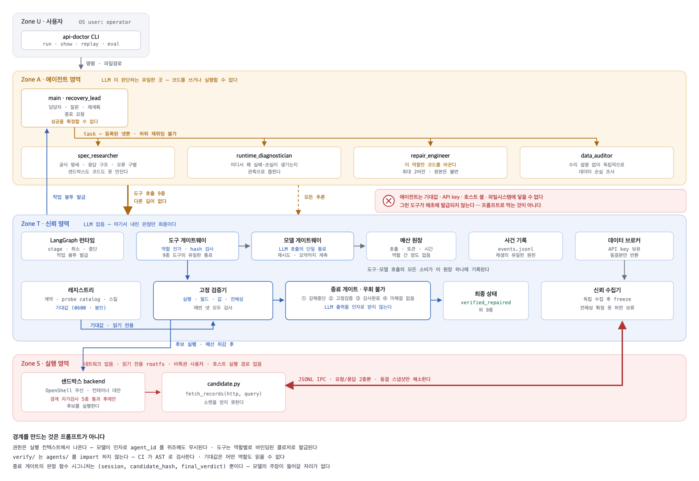
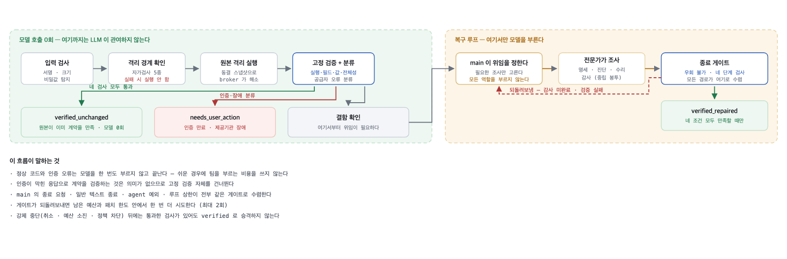
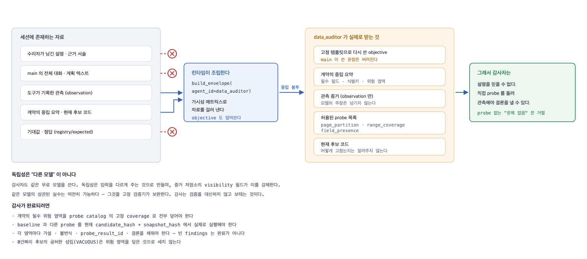
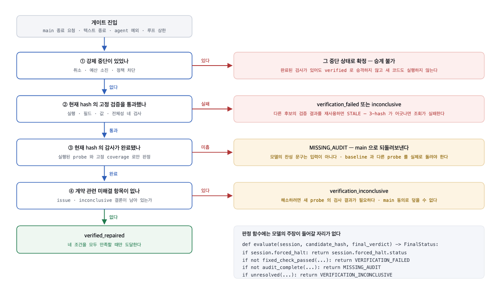

<div align="center">

# api-doctor

**깨진 공공 API 연동 코드를 고치고, 그게 진짜 고쳐졌는지 LLM 없이 검증하는 에이전트**

<br>

`LLM은 어디를 볼지만 정한다. 무엇이 참인지는 LLM이 없는 코드가 정한다.`

<br>


</div>

---

## 문제

공공데이터 API를 붙여본 사람은 이 상황을 안다.

```
200 OK
종료 코드 0
예외 없음
그런데 데이터가 이상하다
```

페이지 경계에서 레코드가 새고, 필드가 조용히 비고, 요청한 범위와 받은 범위가 어긋난다.
에러가 없으니 스택트레이스도 없고 어디를 봐야 할지 단서가 없다. 결국 응답을 눈으로
훑으며 며칠을 태운다.

여기에 LLM을 붙이면 문제가 더 커진다. 모델이 "고쳤습니다"라고 말하는 순간 그 말이 곧
결론이 되기 때문이다. 고친 사람이 채점까지 하는 구조에서는 틀린 수리가 통과한다.

## 접근

판정 권한을 모델에게서 완전히 빼앗았다.

<div align="center">

</div>

시스템을 네 영역으로 나눴다.

| 영역 | 무엇이 있나 | LLM |
|---|---|:---:|
| **U** 사용자 | CLI, 입력 검사, 보고서 | 없음 |
| **T** 신뢰 | 레지스트리, **고정 검증기**, 데이터 브로커, 도구 게이트웨이, 종료 게이트 | **없음** |
| **A** 에이전트 | main + 전문가 4명 | 있음 |
| **S** 격리 | 후보 코드 실행 (네트워크 차단) | 없음 |

Zone A는 Zone T의 검증기와 기대값에 **코드 수준에서 닿을 수 없다.** 프롬프트로 부탁한 게
아니라 import 경계로 막았고, CI가 매번 검사한다.

```python
# tests/test_import_boundaries.py
FORBIDDEN = [
    ("verify",  ("agents", "tools", "model"),          "고정 검증기는 모델 판단과 분리된다 (PRD §3.2)"),
    ("model",   ("agents", "tools", "verify", "sandbox"), "모델 게이트웨이는 예산 외에 아무것도 모른다"),
    ("sandbox", ("agents", "model", "verify"),         "Zone S 는 Zone A 를 모른다"),
    ("agents",  ("evaluation",),  "에이전트가 평가용 비공개 기대값에 닿으면 안 된다 (PRD §7.1 b)"),
    ("tools",   ("evaluation",),  "도구가 평가용 비공개 기대값에 닿으면 안 된다"),
    ("verify",  ("evaluation",),  "제품의 고정 검증과 평가용 세트는 분리된다"),
    ("runtime", ("evaluation",),  "런타임이 평가 세트를 알면 안 된다"),
]
```

테스트가 AST를 파싱해서 실제 import 문을 검사한다. 주석이나 문서가 아니라 코드다.

## 실행 흐름

<div align="center">

</div>

**쉬운 경우에는 팀을 부르지 않는다.** 입력 검사, 격리 경계 확인, 원본 실행, 고정 검증까지는
모델 호출이 0회다. 원본이 이미 계약을 만족하면 `verified_unchanged`로 끝난다.
인증이 만료됐거나 제공기관이 죽었으면 `needs_user_action`으로 끝난다. 둘 다 모델을
한 번도 부르지 않는다.

결함이 확인된 경우에만 복구 루프로 들어간다.

## 에이전트 팀

```
main / recovery_lead      위임과 종료 요청만 한다. 코드를 쓰거나 실행하지 못한다.
 ├─ spec_researcher       공식 명세의 응답 구조, 조회 규칙, 오류 구별
 ├─ runtime_diagnostician 어디서 왜 손실이 생기는지 관측
 ├─ repair_engineer       최소 패치 (이 역할만 코드를 바꾼다)
 └─ data_auditor          수리자의 설명 없이 독립적으로 손실 조사
```

권한은 프롬프트에 적힌 부탁이 아니라 실행 컨텍스트에 바인딩된 클로저다. 모델이
`agent_id`를 위조해도 무시된다.

```
main                    get_budget, read_evidence, read_file, request_finish, request_stop, task
spec_researcher         get_budget, read_evidence, search_spec
runtime_diagnostician   get_budget, inspect_code, inspect_trace, read_evidence, run_probe
repair_engineer         get_budget, inspect_code, read_evidence, run_probe, submit_patch
data_auditor            get_budget, inspect_code, inspect_trace, read_evidence, run_probe

위험 도구 누수: 없음
하위 재위임 가능 역할: 없음
```

## 감사자는 왜 설명을 못 받나

<div align="center">

</div>

감사자에게 수리자의 설명을 주면 감사는 그 설명을 검토하는 일이 된다. 그러면 설명이
그럴듯할수록 통과한다. 런타임이 **중립 작업 봉투를 새로 조립해서** 관측 증거만 넘긴다.
수리자의 서술도, main의 대화도, 기대값도 넘어가지 않는다.

그래서 감사자는 믿을 게 없다. 직접 probe를 돌려 관측해야 결론을 낼 수 있다.

독립성은 "다른 모델을 쓰는 것"이 아니다. 감사자도 같은 모델을 쓴다. 독립성은
**입력을 다르게 주는 것**으로 만들고, 증거 저장소의 `visibility` 필드가 이를 강제한다.

## 종료 게이트

<div align="center">

</div>

`verified_repaired`로 승격하려면 네 조건을 **전부** 만족해야 한다. 우회 경로는 없다.

```python
def evaluate(session, *, candidate_hash, final_verdict) -> GateDecision:
    # ① 강제 중단이 없었나        (취소, 예산 소진, 정책 차단)
    # ② 고정 검증 4종을 통과했나   (실행, 필드, 값, 전체성)
    # ③ 감사가 완료됐나           (모든 위험 영역에 구조화 findings)
    # ④ 미해결 항목이 없나
```

main의 종료 요청, 일반 텍스트 종료, 에이전트 예외, 루프 상한이 전부 같은 게이트로
수렴한다. "끝났다"고 말할 수 있는 경로가 하나뿐이다.

## 격리 실행

후보 코드는 네트워크가 끊긴 컨테이너에서만 돈다.

```
--network none --read-only --cap-drop ALL --security-opt no-new-privileges
--user 65534:65534 --pids-limit 32 --memory 512m --cpus 1 --tmpfs /tmp
```

경계를 믿지 않고 매번 증명한다. 실행 직전에 자가검사 5종을 돌리고, 하나라도
차단되지 않으면 후보를 실행하지 않는다.

| 자가검사 | 무엇을 시도하나 | 결과 |
|---|---|:---:|
| `network_egress` | HTTP 송신, 직접 소켓, DNS 조회 | 차단 |
| `write_outside_workdir` | 작업 디렉터리 밖 쓰기 | 차단 |
| `read_host_secret` | 호스트 비밀 읽기, 환경변수 카나리아 | 차단 |
| `process_limit` | 프로세스 폭증 | 차단 |
| `privilege_escalation` | 권한 상승 | 차단 |

카나리아는 호스트의 docker 프로세스에만 존재하는 환경변수다. 컨테이너 안에서
보이면 환경변수가 경계를 넘은 것이다.

API 키는 후보 코드에 `{KEY}` 자리표시자로만 전달된다. 실제 키는 Zone T의 브로커만
가지고 있고, 후보와 브로커 사이는 JSONL IPC로 통신한다. 후보 코드는 키를 읽을 방법이
없다.

## 검증

### 두 종류의 검증을 분리했다

| | 무엇 | 언제 |
|---|---|---|
| 제품의 고정 검증 | `registry/*/expected/` | 수리 중에 결과를 돌려준다. 모델이 기준을 바꿀 수 없다 |
| 평가용 비공개 세트 | `eval/hidden.json` (0600) | 팀에 숨겼다가 **최종 패치 확정 후에만** 실행 |

비공개 세트는 계약의 주 query와 다른 범위를 쓴다. 팀이 그 범위에 맞춰 최적화할 방법이
없다. 평가 실패를 같은 작업의 재수리로 돌려보내지도 않는다.

### 실측 (2026-09-28)

```
결함 탐지 평가        18/18      거짓 성공 0건
격리 경계 자가검사      5/5      환경변수 카나리아 포함
테스트                181개 통과
구역 간 import 경계   CI 강제
```

### 비공개 검증이 잡아낸 진짜 버그

`mapping_drop_fields` 케이스가 제품에서는 실패인데 비공개 검사는 통과했다. 추적해보니
같은 후보가 세 번 정상 실행된 뒤 **가장 중요한 종료 검증만** 실패하고 있었다.

```
sandbox_run  hash=f509a2b6  returned=5      정상
sandbox_run  hash=f509a2b6  returned=5      정상
sandbox_run  hash=f509a2b6  returned=5      정상
sandbox_run  hash=f509a2b6  returned=None   종료 검증만 실패
브로커 호출: 20 / 20
```

원인은 동결된 스냅샷 읽기까지 공식 API 호출 상한에 넣은 것이었다. 이건 **거짓 실패**를
만드는 종류의 버그다. 거짓 성공과 달리 조용히 지나가고, 비공개 검사가 없었으면
"복구 실패"로 집계됐을 것이다.

## 공급자 가용성 대응

무료 등급의 실제 성공률은 낮다. 모델별로 8회씩 측정했다.

| 모델 | 성공 | 실패 |
|---|:---:|---|
| `nvidia/nemotron-3-super-120b-a12b` (주) | 1/8 | 429×4, 503×3 |
| `nvidia/nemotron-3-nano-omni-30b-a3b-reasoning` | 4/8 | 503×4 |
| `nvidia/llama-3.1-nemotron-70b-instruct` | 0/8 | 404 |
| `nvidia/llama-3.1-nemotron-ultra-253b-v1` | 0/8 | 404 |
| `nvidia/llama-3.1-nemotron-51b-instruct` | 0/8 | 404 |

`/v1/models`에 있다고 부를 수 있는 게 아니다. llama-3.1-nemotron 계열은 목록에
나오지만 `/v1/chat/completions`로는 전부 404였다.

두 실패를 구분해서 다르게 대응한다.

**429는 우리 잘못이다.** 너무 빨리 불렀다. 맞고 물러서는 대신 호출 사이에 최소 간격을
둔다. 429가 오면 간격을 두 배로 늘리고, `Retry-After`가 오면 그쪽을 따른다.

**503은 공급자 과부하다.** 0.1초 만에 즉시 거절되므로 기다려도 줄지 않는다. 폴백
모델로 즉시 갈아탄다.

```
폴백 적용 전   1/8
폴백 적용 후  10/10   (주 모델 7회, 폴백 3회)
```

어떤 모델이 응답했는지는 호출마다 `ModelCall.model`에 기록한다. 그러지 않으면
"성공률이 올랐다"는 말이 어느 모델의 성적인지 알 수 없어 측정이 거짓말이 된다.

## 빠른 시작

```bash
git clone https://github.com/HyeonsangKim/api-doctor.git
cd api-doctor
uv sync --extra agents

export NVIDIA_API_KEY="nvapi-..."     # build.nvidia.com 무료 발급
```

```bash
# 격리 경계와 무료 실행 경로 점검. 모델 호출 0회
api-doctor preflight

# 등록된 데이터셋과 계약 보기
api-doctor datasets

# 복구 실행. 원본이 정상이면 모델을 부르지 않고 끝난다
api-doctor run -d seoul_library -c examples/connector_partial.py

# 하네스 교체 (비교 실험용)
api-doctor run -d seoul_library -c broken.py --harness builtin
api-doctor run -d seoul_library -c broken.py --harness single

# 결과 다시 보기. 외부 호출 0회
api-doctor show <run-id>
api-doctor replay <run-id>

# 평가
api-doctor eval --split dev                    # 결함 탐지, 모델 호출 0회
api-doctor eval --recovery --split dev         # 복구, 모델 사용
```

Docker가 필요하다. 격리 자가검사가 통과하지 않으면 후보 코드를 실행하지 않는다.

`--source`는 기본이 `fixture`(동결 스냅샷)다. `live`는 실제 제공기관을 호출한다.

## 기술 스택

**NVIDIA**

| 항목 | 내용 |
|---|---|
| 모델 | `nvidia/nemotron-3-super-120b-a12b` (reasoning) |
| 폴백 | `nvidia/nemotron-3-nano-omni-30b-a3b-reasoning` |
| 엔드포인트 | NVIDIA NIM, `https://integrate.api.nvidia.com/v1` (OpenAI 호환) |
| 프로파일링 | NeMo Agent Toolkit 형식의 역할별 구간 리포트 |

reasoning 모델이라 추론 토큰이 `completion_tokens`에 함께 잡힌다. 사소한 JSON 한 줄에도
출력 258토큰이 나갔다. 역할별 출력 상한을 따로 잡았다 (수리자 12288, 나머지 3072).

**에이전트 하네스**

deepagents 0.7.19가 기본이다. LangChain의 `wrap_tool_call` 미들웨어 훅에서 `task`
위임을 가로채 예산과 권한과 중복 위임을 검사한다.

기본 파일시스템 백엔드가 호스트에 닿지 않는 `StateBackend`임을 확인하고,
`FilesystemMiddleware(tools=["read_file"])`로 쓰기 도구를 제거했다. 자동 요약
미들웨어는 껐다. main의 모델 예산을 몰래 먹고 있었다.

**그 외**

Python 3.12, uv, Typer, Rich, Pydantic, httpx, pytest, Docker

## 문서

| 문서 | 내용 |
|---|---|
| [PRD v0.2](docs/PRD_api-doctor_v0.2.md) | 요구사항, 수용 기준 |
| [아키텍처](docs/ARCHITECTURE_api-doctor_v0.2.md) | 신뢰 영역, 모듈 배치, 상태 기계, 추적성 |
| [회의용 브리핑](docs/meeting/meeting-architecture.html) | 도면 4종과 전체 해설 |
| [Phase 0 기록](docs/PHASE0_keys_and_limits.md) | 키 발급, 실측 한도, 되짚은 판단들 |

## 개발 기록에서 남길 만한 것

**deepagents를 한 번 잘못 기각했다.** 호스트 파일시스템에 닿는다고 판단해서
배제했는데, 근거 두 개가 다 틀렸다. 기본 백엔드는 호스트를 건드리지 않는
`StateBackend`이고, `FilesystemMiddleware(tools=[...])`는 도구를 완전히 제거한다.
`HarnessProfile.excluded_tools`만 시험해보고 내린 결론이었다. 문서를 조용히
덮어쓰지 않고 철회 기록으로 남겼다.

**진단을 한 번 틀렸다.** 역할별 호출 상한이 강제되지 않는 것처럼 보였다.
`spec_researcher`가 10회, `runtime_diagnostician`이 15회를 쓴 사건이 남아 있었다.
실제로는 그게 *시도* 수였고 공급자 실패는 환불되므로 과금된 호출은 1회와 4회였다.
환불이 있는 원장에서는 사건 수와 과금 수를 섞어 세면 안 된다.

**평가가 처음에 엉뚱한 걸 쟀다.** 결함 탐지를 최종 상태로 판정했는데, 키가 없으면
모든 결함 케이스가 `needs_user_action`으로 끝난다. "결함을 탐지했는지"가 아니라
"키가 없는지"를 재고 있었다. baseline 판정으로 바꿨다.

**내가 만든 격리 시험이 틀렸다.** 호스트 비밀 읽기 시험이 `PermissionError`로
죽어서 실패로 잡혔는데, 사실은 샌드박스가 가정보다 더 엄격했던 것이다.
`Path.exists()`가 EACCES를 삼키지 않는다. "실제로 읽히는가"를 묻도록 고치고
환경변수 카나리아를 추가했다.
