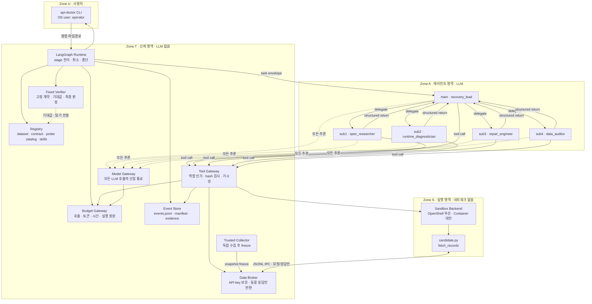
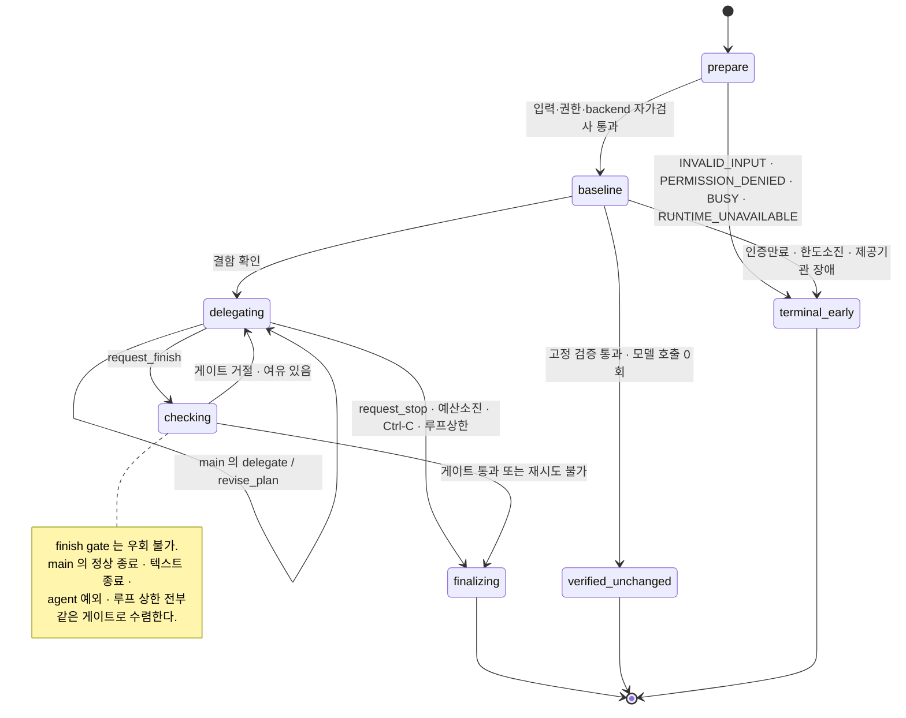
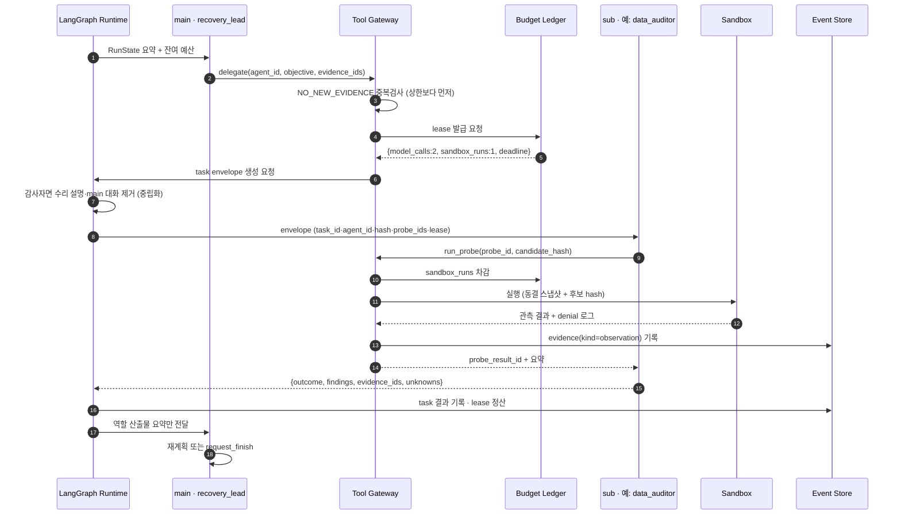
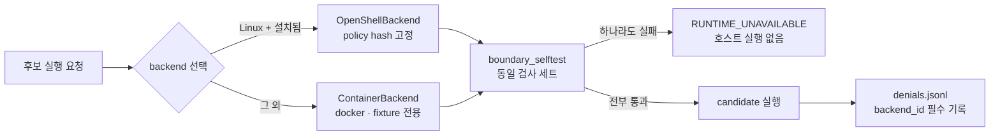
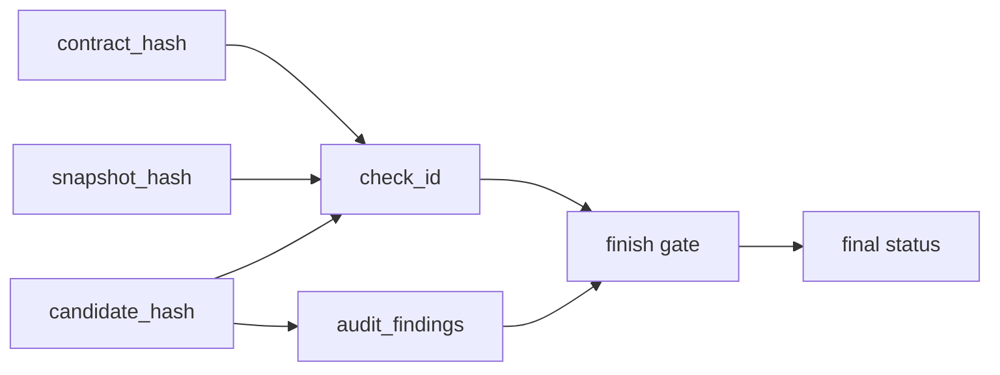
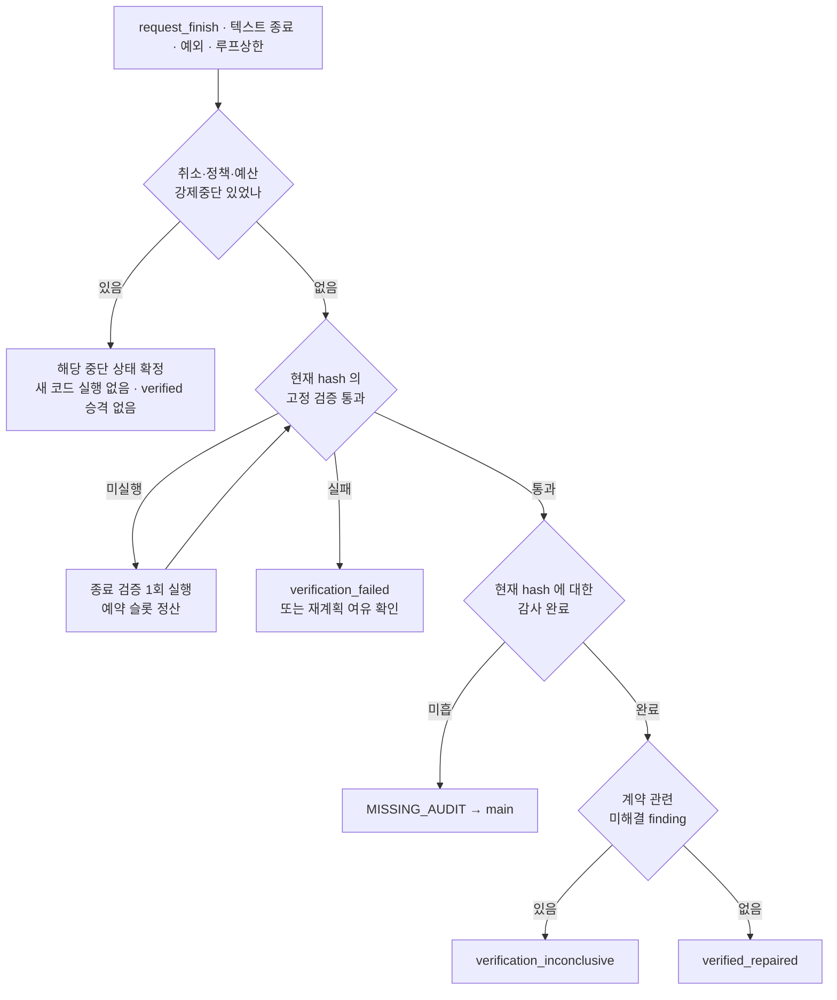

# API닥터 아키텍처 v0.2

> **기준 문서**: [PRD v0.2](PRD_api-doctor_v0.2.md)
> **작성일**: 2026-09-27 · Asia/Seoul
> **상태**: 설계 문서. 구현 착수 전 기준선.
> **대상 환경 (실측)**: darwin 25.5.0 (Apple Silicon), Python 3.14.2 설치됨, `uv` 있음, `docker` 있음, `podman` 없음, `NVIDIA_API_KEY` 미설정

이 문서는 PRD의 요구사항을 **구현 가능한 경계·모듈·계약**으로 옮긴다. PRD의 내용을 반복하지 않고, PRD가 "무엇을"이라면 이 문서는 "어디에 무엇을 두고 무엇이 무엇을 못 하게 막는가"를 정한다.

---

## 1. 아키텍처를 지배하는 한 문장

> **LLM은 어디로 갈지만 정하고, 무엇이 참인지는 LLM이 없는 코드가 정한다.**

이 제품의 모든 구조적 결정은 이 문장에서 파생된다. 에이전트를 5개로 나눈 것도, 검증기를 분리한 것도, 도구를 gateway 뒤에 둔 것도 전부 같은 이유다. 따라서 아키텍처의 1차 분할 단위는 **컴포넌트가 아니라 신뢰 영역**이다.

---

## 2. 신뢰 영역 (Trust Zones)

세 영역으로 나눈다. 영역 경계를 넘는 것은 **좁고 명시적인 계약**뿐이며, 경계는 프롬프트가 아니라 프로세스·파일권한·컨테이너로 강제한다.



### 2.1 경계별 차단 규칙

| 경계 | 통과 가능한 것 | 절대 통과 못 하는 것 | 강제 수단 |
|---|---|---|---|
| U → T | 파일 경로, dataset_id, query, 취소 시그널 | 임의 실행 인자, 절대경로 탈출, 심볼릭 링크 | 경로 정규화 + run root 하위 검사 |
| T → A | 발췌된 evidence, 중립 objective, budget lease | API key, 기대값, 원본 쓰기 핸들, 전체 파일시스템 | Tool Gateway 화이트리스트 + evidence visibility |
| A → T | 9종 도구 호출, 구조화 반환 | 정책 변경, 예산 재설정, 최종 상태 쓰기 | 도구 스키마 + `request_finish`는 예약만 |
| T → S | candidate.py (ro), 동결 스냅샷 응답 | API key, 호스트 FS, 네트워크, 정답 | `--network none` + ro mount + cap drop |
| S → T | stdout 제한분, 반환 레코드, denial 로그 | 임의 파일 쓰기, 외부 연결 | 컨테이너 정책 + 출력 크기 상한 |

**핵심 불변식**: Zone A는 Zone S에 **직접 닿지 않는다**. 수리 에이전트도 `submit_patch`로 후보를 만들 뿐, 실행은 Tool Gateway가 예산을 차감한 뒤 Zone T가 수행한다.

---

## 3. 컴포넌트 · 모듈 배치

```
api-doctor/
├── pyproject.toml              # uv, requires-python = ">=3.12,<3.13"
├── policies/
│   └── sandbox.yaml            # FR-021 · hash가 manifest에 기록됨
├── registry/                   # Zone T · 사람이 검토한 고정 자료
│   ├── datasets/seoul_library/
│   │   ├── dataset.yaml        # allowed_endpoints, live_ready, 라이선스, 출처
│   │   ├── contract.v1.yaml    # 필수 필드·타입·식별키·audit_requirements
│   │   ├── probes.v1.yaml      # probe catalog + coverage metadata
│   │   ├── snapshots/          # 동결 공개 응답 (재배포 가능 확인분)
│   │   └── expected/           # ⚠ 기대값. 0600. evidence store 밖. sandbox 미마운트
│   └── skills/seoul_library/SKILL.md   # FR-016
└── src/api_doctor/
    ├── cli/                    # Zone U
    │   └── main.py             # datasets · run · show · replay · delete
    ├── registry/
    │   └── loader.py           # 로드 + hash lock + REGISTRY_INVALID
    ├── runtime/                # Zone T 오케스트레이션
    │   ├── graph.py            # LangGraph StateGraph · stage 전이
    │   ├── state.py            # RunState (TypedDict)
    │   ├── budget.py           # BudgetLedger · Lease · 시간우선 정산
    │   ├── events.py           # append-only + atomic manifest
    │   ├── evidence.py         # evidence store + visibility 매트릭스
    │   ├── envelope.py         # task envelope 생성 (감사자 중립화)
    │   └── gate.py             # finish gate · MISSING_AUDIT · UNRESOLVED_FINDING
    ├── model/
    │   └── gateway.py          # BaseChatModel 래퍼 · 모든 호출 계측
    ├── agents/                 # Zone A
    │   ├── lead.py             # deepagents 또는 create_agent supervisor
    │   ├── subagents.py        # 4개 CompiledSubAgent 정의
    │   ├── prompts/            # 역할별 system prompt
    │   └── inventory.py        # AC-01 tool inventory 실측 검사
    ├── tools/                  # Zone A ↔ T 경계
    │   ├── gateway.py          # ToolContext 바인딩 · 역할 ACL
    │   ├── read_evidence.py  search_spec.py  inspect_code.py
    │   ├── inspect_trace.py  run_probe.py    submit_patch.py
    │   └── get_budget.py     request_finish.py  request_stop.py
    ├── data/
    │   ├── broker.py           # key 보유 · 허용 GET만 · 동결분만 반환
    │   └── collector.py        # live 독립 수집 → freeze → snapshot_hash
    ├── sandbox/
    │   ├── base.py             # SandboxBackend 프로토콜 + BoundaryReport
    │   ├── selftest.py         # backend 공통 경계 자가검사
    │   ├── openshell.py        # 우선 backend (Linux)
    │   ├── container.py        # docker 대안 backend (fixture 전용)
    │   └── harness.py          # 컨테이너 안에서 도는 실행 하네스
    ├── verify/                 # ⚠ agents/ · tools/ 를 import 하지 않음
    │   ├── verifier.py         # 실행·필드·값·전체성 4검사
    │   └── probes.py           # probe catalog 실행기
    ├── report/
    │   ├── build.py            # report.md · report.json · patch.diff
    │   └── sanitize.py         # escape sequence · 제어문자 제거
    └── profiling/
        └── nat.py              # FR-018 · 실패 시 gateway 원장 fallback
```

### 3.1 의존 방향 규칙 (테스트로 강제)

```
cli → runtime → {registry, budget, events, verify, sandbox, data}
agents → tools → {budget, events, evidence, sandbox, data}
verify → registry            (단방향. agents/tools/model 을 절대 import 안 함)
model  → budget              (그 외 아무것도 모름)
```

`tests/test_import_boundaries.py`가 AST로 import 그래프를 검사한다. `verify/`가 `agents/`를 참조하면 CI 실패다. 이게 "검증기는 모델과 분리"를 문서가 아니라 코드로 만드는 방법이다.

---

## 4. 제어 흐름 · LangGraph 상태기계

stage는 **기술적 진행 표시**이며 역할 호출 순서가 아니다 (PRD §3.3). `delegating` 안에서 어느 역할을 몇 번 부를지는 전적으로 main이 정한다.



### 4.1 `delegating` 루프 내부



**여기서 놓치면 안 되는 3가지**
1. `agent_id`는 envelope에서 런타임이 **발급**한다. 모델이 인자로 넣는 값은 무시한다 (AC-07).
2. 감사자 envelope는 main 컨텍스트를 상속하지 않고 런타임이 새로 **조립**한다 (R-07).
3. `NO_NEW_EVIDENCE` 검사가 역할별 2회 상한보다 **먼저** 돈다 (PRD §5.3.3).

### 4.2 취소 전파 (AC-08)

Ctrl-C는 "다음 호출을 막는 플래그"만으로는 부족하다. 진행 중인 모델 HTTP(최대 45초)와 sandbox 프로세스(최대 15초)가 남아 있기 때문이다. 단일 `CancelToken`을 run 전역에 두고 **세 경로에 동시에 연결**한다.

```
SIGINT ──► CancelToken.set()
             ├─► BudgetLedger.can_call()  → 즉시 CANCELLED  (2초 이내 새 호출 차단)
             ├─► ModelGateway             → in-flight httpx request.cancel()
             └─► SandboxBackend           → 컨테이너 SIGKILL + 정리 (5초 상한)
그 후: 부분 기록 flush → finish gate 진입 → forced_halt=cancelled 로 종료
```

- `CancelToken`은 Zone T 소유다. 에이전트는 읽지도 쓰지도 못한다.
- 취소 후에도 **finish gate는 반드시 통과**하되, `forced_halt`가 세팅돼 있으므로 §9의 첫 분기에서 즉시 `cancelled`로 확정된다. 부분 검사 결과가 있어도 verified 승격은 없다.
- 프로세스 강제 종료(SIGKILL)로 이 경로도 못 도는 경우는 다음 CLI 시작 시 `.lock`의 프로세스 생존 확인으로 감지해 `interrupted`로 마감한다 (PRD §4.4).

---

## 5. Budget Gateway — 시간 우선 정산

PRD §4.1의 상한을 그대로 구현하되, **PRD 안에 내부 충돌이 있어 정산 순서를 명시**한다.

### 5.1 발견된 예산 충돌

| 항목 | PRD 수치 | 충돌 |
|---|---|---|
| 총 토큰 | 입력+출력 192,000 | 24회 × 회당 입력 8,000 = **192,000** → 출력 몫 0 |
| 총 호출 | 24회 | 24 × (8,000 + 2,048) ≈ 241,000 > 192,000 |
| 총 시간 | 600초 | 24회 × 모델 HTTP 45초 = 1,080초 > 600초 |

→ **세 상한은 동시에 도달 불가능하다.** 실질 상한은 토큰과 시간이며, 24회는 도달하지 않는다.

### 5.2 구현 결정

`BudgetLedger`는 **가장 먼저 고갈되는 자원을 기준으로 차단**하고, 세 원장을 전부 기록한다.

```python
@dataclass(frozen=True)
class Lease:
    model_calls: int; sandbox_runs: int; deadline: float
    # 발급 시점: min(전체잔여, 역할별잔여, 시간환산가능량)

class BudgetLedger:
    HARD = {"model_calls": 24, "tokens": 192_000, "wall_seconds": 600}
    PER_ROLE_CALLS = {"main": 8, "spec_researcher": 4, ...}
    RESERVED = {"sandbox_runs": 1, "cleanup_seconds": 20}   # 종료용, 양도 불가

    def can_call(self, role) -> Verdict:
        # 순서 고정: 취소 → 정책 → 시간 → 토큰 → 호출수 → 역할별
        # 예약분을 뺀 가용량으로 판정. 초과 예상이면 모델 없이 중단 보고서.
```

- **토큰 예약 후 정산**: 호출 전 `입력추정 + max_output`을 예약, `usage` 반환 시 정산. `usage` 없으면 예약분 반환하지 않고 `tokens_kind="estimated"` 표기 (PRD §4.1 준수).
- **모든 호출은 Model Gateway 통과**: LangChain의 구조화 출력 재시도·자동 요약까지 잡으려면 콜백이 아니라 `BaseChatModel` 서브클래스로 감싸고, 하위 클라이언트는 `max_retries=0`으로 두어 재시도를 우리가 센다.
- **역할 간 양도 없음**: lease 반납 시 미사용분은 전체 풀로만 돌아가고 다른 역할 상한을 올리지 않는다.

---

## 6. 증거 가시성 매트릭스 (감사 독립성의 실체)

"독립 감사"는 다른 모델을 쓰는 게 아니라 **입력을 다르게 주는 것**이다 (PRD §3.2). Evidence Store가 `visibility` 필드로 강제한다.

| 자료 | main | spec | diag | repair | **audit** | verifier |
|---|:--:|:--:|:--:|:--:|:--:|:--:|
| 공식 문서 발췌 | 요약 | ✅ | ✅ | 전달분 | ✅ | — |
| 원본 코드 | 요약 | ✖ | ✅ | ✅ | ✅ | ✅ |
| 현재 candidate | hash만 | ✖ | ✅ | ✅ | ✅ | ✅ |
| **수리자의 설명·근거 서술** | ✅ | ✖ | ✖ | ✅ | **✖** | ✖ |
| **main 전체 대화** | ✅ | ✖ | ✖ | ✖ | **✖** | ✖ |
| 도구 관측 원문 (observation) | 요약 | 해당분 | 해당분 | 자기분 | ✅ | ✅ |
| 중립 계약 요약 | ✅ | ✅ | ✅ | ✅ | ✅ | — |
| **기대값 · 정답** | ✖ | ✖ | ✖ | ✖ | **✖** | ✅ |
| API key | ✖ | ✖ | ✖ | ✖ | ✖ | ✖ (broker만) |

`evidence_id`마다 `kind ∈ {observation, assertion}`을 붙인다. **모델이 만든 것은 전부 `assertion`**이며, assertion을 인용해도 관측으로 승격되지 않는다. finish gate는 `observation` 근거가 붙지 않은 finding 해소를 거절한다.

---

## 7. Sandbox — backend 추상화와 macOS 현실

### 7.1 확정된 제약

PRD FR-021은 OpenShell을 P0로 두지만 **이 개발 머신은 darwin이다**. OpenShell은 Linux 대상이다. PRD R-14가 예측한 상황이 이미 확정 사실이다.

### 7.2 결정



- `SandboxBackend` 프로토콜: `boundary_selftest()`, `run()`, `collect_denials()`. 두 backend가 **같은 자가검사 세트**를 통과해야 후보를 돌린다.
- `HostBackend`는 **존재하지 않는다**. 코드베이스에 넣지 않는다 (AC-10).
- 컨테이너 정책: `--network none --read-only --cap-drop ALL --security-opt no-new-privileges --pids-limit 32 --memory 512m --cpus 1 --tmpfs /tmp:size=16m`, 후보 디렉터리는 ro 마운트.
- **denial 기록에 `backend_id`를 필수 필드로 넣는다.** 보고서 생성기는 `backend_id != "openshell"`인 denial을 OpenShell 증거 섹션에 넣지 못한다 (AC-15). 코드로 막는다.
- OpenShell 차단 시연은 Ubuntu 환경에서 별도 수행하고 그 run_id를 따로 보관한다.

### 7.3 `http` 객체 — 네트워크 없이 요청하기

후보 인터페이스는 `fetch_records(http, query) -> list[dict]`다. `--network none` 상태에서 `http`가 동작하는 방식:

```
[컨테이너 내부]                         [호스트 Zone T]
harness.py
  http.get(url, params)
    → stdout 에 JSONL 1줄 ────────────→ Broker
      {"t":"req","url":...,"params":...}     ├ 허용 endpoint·query 검사
                                              ├ 동결 스냅샷 조회
    ← stdin 으로 JSONL 1줄 ←────────────      └ 없으면 UNSUPPORTED_REQUEST
      {"t":"res","status":200,"body":...}
  candidate.fetch_records(http, query)
```

- 후보 코드는 실제 소켓을 절대 얻지 못한다. `requests`/`urllib` 직접 사용 시도는 `--network none`에서 실패하고 denial로 기록된다.
- fixture와 live의 차이는 **Collector 단계에서만** 존재한다. live도 신뢰된 collector가 먼저 수집·동결한 뒤 후보를 돌리므로, Zone S 관점에서 두 경로는 동일하다 (PRD §4.5).
- IPC는 임의 shell/파일경로를 지원하지 않는 2종 메시지(`req`/`res`)뿐이다.

### 7.4 Collector 동결 일관성 (AC-14)

live 경로에서 "일부만 수집됐는데 전체 복구로 판정"되는 사고를 막는 지점은 sandbox가 아니라 **Collector**다. 동결 직전에 전체성을 확정하지 못하면 그 run은 애초에 검증 가능한 run이 아니다.

```python
# data/collector.py
def freeze(dataset, query) -> Snapshot | Inconclusive:
    pages = fetch_all_pages(query)              # 신뢰된 수집기. 후보와 무관
    if not consistent(pages):                   # 아래 3검사
        return Inconclusive(reason="live_shifted")
    return Snapshot(hash=..., collected_at=..., total=...)
```

일관성 3검사:
1. **총건수 안정**: 첫 페이지와 마지막 페이지가 보고한 total이 같은가
2. **버전/갱신시각 안정**: 응답에 버전 필드가 있으면 전 페이지 동일한가
3. **식별키 정합**: 수집된 레코드 수 == total, 식별키 중복 없음

하나라도 실패하면 재수집 1회(§4.1의 재시도 한도 안), 그래도 실패하면 **`verification_inconclusive`로 즉시 종료**한다. 모델을 부르지 않는다 — 부를 대상이 없다. 보고서에는 항상 `collected_at` 기준 검증임을 명시한다.

---

## 8. 데이터 · 산출물 레이아웃

```
~/.api-doctor/runs/<run_id>/          # 0700
├── manifest.json                     # 0600 · 원자적 교체 · events 에서 파생
├── events.jsonl                      # 0600 · append-only · seq 단조증가 · 진실의 원천
├── tasks.json                        # 위임 원장
├── evidence/
│   ├── manifest.json                 # evidence_id · kind · visibility · hash
│   └── <evidence_id>.json
├── candidates/
│   ├── original.py                   # 사용자 파일의 읽기전용 복사본
│   ├── v1.py  v2.py                  # 최대 2버전 (FR-010)
│   └── patch.diff
├── checks/                           # candidate_hash + contract_hash + snapshot_hash 로 키
├── denials.jsonl                     # backend_id 필수
├── profiling/                        # standardized_data_all.csv · gantt_chart.png
├── report.md  report.json
└── .lock                             # 프로세스 생존 확인형 잠금
```

### 8.1 hash 체인



**STALE 판정의 근거**: 모든 검사·감사 결과는 `(candidate_hash, contract_hash, snapshot_hash)` 3종 조합으로 키가 잡힌다. 패치가 바뀌면 `candidate_hash`가 바뀌고 이전 감사는 자동 만료된다 (AC-13). 별도 만료 로직이 필요 없다 — 키가 안 맞으면 조회가 실패할 뿐이다.

### 8.2 이벤트 타입 분류

`events.jsonl`은 replay(AC-12)·적응성 증명(AC-03)·사용량 대조(AC-16)의 **유일한 원천**이다. 타입을 고정하지 않으면 셋 다 사후에 만들 수 없으므로 여기서 확정한다.

| type | 기록 주체 | 필수 필드 | 쓰이는 곳 |
|---|---|---|---|
| `run_started` | runtime | source, hashes, limits, backend_id | manifest |
| `stage_changed` | runtime | from, to | replay |
| `baseline_result` | verifier | pass/fail, per-check | AC-05 |
| `plan_revised` | main | 이전 계획, 변경 이유 | **AC-03** |
| `delegation_requested` | main | agent_id, objective, evidence_ids | **AC-03** |
| `delegation_rejected` | gateway | reason: NO_NEW_EVIDENCE / 상한 | AC-03 |
| `delegation_started` / `_finished` | runtime | task_id, lease, outcome | tasks.json |
| `model_call` | model gateway | agent_id, in/out tokens, latency_ms, tokens_kind | **AC-16** |
| `tool_call` | tool gateway | agent_id, tool, allow/deny, reason | AC-07 |
| `evidence_added` | tool gateway | evidence_id, kind, visibility, hash | AC-04 |
| `patch_submitted` | tool gateway | version, base_hash, candidate_hash | AC-13 |
| `sandbox_run` | sandbox | backend_id, exit, duration, denial 수 | AC-10, AC-15 |
| `policy_denied` | sandbox | backend_id, dest, binary, reason, ts | **AC-15** |
| `check_result` | verifier | check_id, 3-hash, pass/fail/inconclusive | AC-09 |
| `audit_returned` | runtime | 위험영역별 결론, probe_result_id | AC-04 |
| `gate_evaluated` | gate | 4분기 각각의 불리언 | AC-09 |
| `budget_event` | ledger | 자원, 예약/정산/차단 | AC-08 |
| `run_finished` | runtime | status, reason, usage 합계 | 전체 |

**AC-16 대조 규칙**: `model_call` 이벤트를 `agent_id`로 group-by 한 합계가 gateway 원장이다. NAT 프로파일러 csv와 이 합계가 다르면 차이를 보고서에 적고 **예산 판단은 원장을 따른다** (PRD가 명시).

**replay 격리 규칙 (AC-12)**: `cli replay` 경로는 `model/`·`sandbox/`·`data/`를 **import 하지 않는다**. §3.1의 import 경계 테스트가 이것도 검사한다. "외부 호출 0회"를 런타임 플래그가 아니라 의존성 부재로 보장한다.

### 8.3 보관·만료 (AC-11)

만료 처리는 별도 데몬 없이 **모든 CLI 진입점의 첫 단계**에서 수행한다.

```
CLI 시작 → sweep(runs_root, retention=7d)
             ├─ mtime > 7d  → 디렉터리 삭제
             └─ 그 후 요청된 run_id 해석
해석 결과: 존재 + 권한 O → 정상 / 존재 + 권한 X → PERMISSION_DENIED
           방금 sweep 됨   → EXPIRED      / 처음부터 없음 → NOT_FOUND
```

`EXPIRED`와 `NOT_FOUND`를 구분하려면 sweep이 이번 호출에서 지운 ID를 기억해야 한다. sweep 결과를 메모리에 들고 그 요청 안에서만 사용한다 (tombstone 파일을 만들지 않는다 — PRD §4.3).

---

## 9. finish gate — 우회 불가 지점



게이트 판정 함수는 **불리언 4개의 논리곱**이며 LLM 출력을 입력으로 받지 않는다.

```python
def evaluate(run: RunState) -> FinalStatus:
    if run.forced_halt:            return run.forced_halt.status      # 승계 불가
    if not fixed_check_passed(run.candidate_hash, run.contract_hash, run.snapshot_hash):
        return VERIFICATION_FAILED
    if not audit_complete(run.candidate_hash):    return MISSING_AUDIT
    if unresolved_contract_findings(run):         return VERIFICATION_INCONCLUSIVE
    return VERIFIED_REPAIRED
```

`audit_complete`의 판정 기준 (PRD §3.2 런타임 확인 조건):
- 계약의 `audit_requirements` 위험 영역이 probe catalog의 **고정 coverage metadata 합집합**으로 전부 덮이는가
- 현재 `candidate_hash + snapshot_hash`에서 **baseline과 다른 probe 최소 1개**가 감사 호출로 실제 실행됐는가
- 각 위험 영역마다 `{가설, 불변식, evidence_id, probe_result_id, 결론}`이 채워졌는가

모델의 "괜찮습니다"는 이 함수 어디에도 입력이 아니다.

---

## 10. 에이전트 팀 구성

### 10.1 런타임 선택

PRD §5.3.4의 우선안(deepagents)을 채택하되 **실측 검사로 보증**한다. deepagents는 기본적으로 파일시스템 도구·`task` 도구·general-purpose 서브에이전트를 제공하므로, 이것이 남아 있으면 AC-01이 즉시 실패한다.

```python
# agents/inventory.py
ALLOWED = {
    "main": {"delegate","revise_plan","get_budget","request_finish","request_stop","read_evidence"},
    "spec_researcher":        {"search_spec","read_evidence","get_budget"},
    "runtime_diagnostician":  {"inspect_code","inspect_trace","run_probe","read_evidence","get_budget"},
    "repair_engineer":        {"inspect_code","submit_patch","run_probe","read_evidence","get_budget"},
    "data_auditor":           {"inspect_code","inspect_trace","run_probe","read_evidence","get_budget"},
}

def assert_inventory(compiled) -> None:
    """초기화 직후 컴파일된 그래프의 실제 bound tool 을 순회한다.
    허용목록 밖 도구 · 동적 생성 도구 · 하위 재위임 발견 시 RuntimeError."""
```

> **행동(action)과 도구(tool)의 구분**: PRD §5.1.3의 9종이 "도구"이고, `delegate`·`revise_plan`은 main의 **하네스 행동**이다(deepagents의 `task`에 해당하되 4개 대상으로 고정). 위 `ALLOWED["main"]`은 둘을 합친 "main이 호출할 수 있는 전부"의 목록이며, 구현에서는 행동과 도구를 서로 다른 레이어로 등록한다. 전문가에게는 행동을 하나도 주지 않는다 — 그래서 하위 재위임이 구조적으로 불가능하다.
>
> **스킬은 도구가 아니다**: PRD §5.3.2의 "해당 API 스킬"은 `search_spec`이 반환하는 사전검토 자료이지 별도 도구가 아니다 (§5.3.6). 그래서 `ALLOWED["spec_researcher"]`에 스킬 도구가 없다.

- 검사 지점은 **두 곳**: 초기화 직후(inventory), 호출 시점(Tool Gateway ACL). 프롬프트는 셋 중 어느 것도 아니다.
- deepagents로 경계를 못 만들면 `create_agent` 기반 supervisor로 교체한다. 교체해도 **1+4 구조·도구 계약·LangGraph 상태는 유지**한다. `build_lead()` 팩토리 한 곳만 바꾸면 되도록 설계한다.
- 전문가에게는 `task`·동적 생성 도구를 주지 않는다. 전문가끼리 직접 통신 경로가 없다 (main만 경유).

### 10.2 모델 배치

다섯 역할 전부 **같은 NVIDIA 무료 hosted Nemotron**을 쓴다. 역할 분리는 모델이 아니라 **컨텍스트·도구·가시성**으로 만든다 (PRD §3.2). 역할별 다른 모델을 쓰지 않으므로 상관된 실수는 발생 가능하며, 그것을 고정 검증기가 보완한다는 것이 이 설계의 전제다.

---

## 11. FR ↔ 모듈 추적표

| FR | 모듈 | 검증 AC |
|---|---|---|
| FR-001 | `registry/loader.py`, `registry/datasets/**` | — |
| FR-002 | `agents/subagents.py`, `agents/inventory.py` | AC-01 |
| FR-003 | `runtime/budget.py`, `model/gateway.py` | AC-08 |
| FR-004 | `data/broker.py`, `sandbox/*`, 파일 권한 | AC-07, AC-10 |
| FR-005 | `cli/main.py`, 입력 검사 | — |
| FR-006 | `runtime/graph.py:baseline`, `verify/verifier.py` | AC-05 |
| FR-007 | `agents/lead.py`, `runtime/envelope.py` | AC-03 |
| FR-008–011 | `agents/subagents.py`, `tools/*` | AC-02, AC-04 |
| FR-012 | `runtime/gate.py` | AC-09, AC-13 |
| FR-013 | `runtime/graph.py` terminal 분기 | AC-06, AC-14 |
| FR-014 | `runtime/events.py`, `runtime/evidence.py` | AC-11 |
| FR-015 | `cli/main.py`, `report/build.py` | AC-12 |
| FR-016 | `registry/skills/**` | — |
| FR-017 | `eval/` (Phase 4) | — |
| FR-018 | `profiling/nat.py` | AC-16 |
| FR-021 | `sandbox/*`, `policies/sandbox.yaml`, `report/build.py` | AC-15 |
| FR-018b (P1) | `profiling/nat_eval.py` — Phase 5 | — |
| FR-019 (P2) | 미착수. 별도 화면·인가 명세 선행 | — |

**AC 커버리지**: AC-01~AC-16 전부 위 모듈에 귀속됐다. PRD Phase 3의 검증 목록은 AC-01–14까지만 적혀 있으나 (FR-021·FR-018이 나중에 추가된 탓), **AC-15·AC-16은 M3에 포함**한다.

---

## 12. 구현 순서 — 수직 슬라이스

PRD Phase 0–4를 그대로 순차 진행하면 데모가 나오지 않는다. **아래 순서는 각 단계마다 돌아가는 것이 남는다.**

| M | 내용 | 끝나면 증명되는 것 | LLM |
|---|---|---|:--:|
| **M0** | uv 프로젝트(py3.12), 의존성 고정, NVIDIA key 스모크, docker 경계 자가검사, OpenShell 가용성 기록 | 무료 경로·격리가 실재함 | 1회 |
| **M1** | registry + contract + fixture + broker + sandbox + verifier + events + CLI(run은 baseline까지) / show / replay / delete | **모델 없이** baseline·검증·차단·재생이 돈다 | ✖ |
| **M2** | model gateway + tool gateway + 1+4 에이전트 + finish gate | 위임·감사·게이트가 실제 모델로 돈다 | ✅ |
| **M3** | 복합 결함 대표 사례 + report.md/json + diff + NAT 프로파일러 | 데모 가능 | ✅ |
| **M4** | 평가 세트 일부 + B(단일에이전트) vs C 비교 | 구조의 효용 측정 | ✅ |

**M1이 LLM 없이 완주되는 것이 이 설계의 시금석이다.** M1만으로 AC-05·AC-10·AC-11·AC-12·AC-15(컨테이너분)가 증명된다. M2가 실패해도 M1은 남는다.

---

## 13. 확정된 기술 결정

| 항목 | 결정 | 근거 |
|---|---|---|
| Python | **3.12** (uv로 고정) | 설치된 3.14.2는 langgraph/deepagents 스택에 과도하게 최신 |
| 패키지 | `uv` | 이미 설치됨, lock 재현성 |
| CLI | `typer` + `rich` | 진행 출력(stderr) / JSON(stdout) 분리 |
| 오케스트레이션 | `langgraph` StateGraph | PRD §5.3.4 |
| 에이전트 | `deepagents` 우선, `create_agent` 대안 | PRD §5.3.4, `build_lead()` 뒤로 격리 |
| 모델 | NVIDIA hosted Nemotron (OpenAI 호환) | PRD §5.3.5, 0원 |
| Sandbox | `ContainerBackend`(docker) 주, `OpenShellBackend`(Linux) | 개발기가 darwin |
| 저장 | 파일 + JSONL (DB 없음) | PRD §5.2 |
| 검증기 | 순수 Python, import 경계 테스트로 격리 강제 | PRD §3.2 |

---

## 14. 미해결 · 착수 전 확인 필요

| # | 항목 | 차단 여부 | 처리 |
|---|---|---|---|
| 1 | `NVIDIA_API_KEY` 미설정 | **M2 차단** | 사용자가 build.nvidia.com에서 발급. M0·M1은 진행 가능 |
| 2 | 서울 공공도서관 실제 서비스명·필드·페이지 지원 여부 | M1 일부 차단 | M0에서 정상 호출 1회로 확인. 안 되면 KOSIS로 교체 |
| 3 | deepagents의 기본 도구 완전 비활성화 가능 여부 | M2 설계 분기 | M0 스모크에서 `assert_inventory`로 판정 |
| 4 | NAT 프로파일러의 역할별 구분 (R-13) | M3 비차단 | 안 되면 gateway 원장만 보고 (PRD가 이미 허용) |
| 5 | OpenShell 차단 시연 환경 | M3 비차단 | Ubuntu에서 별도 run. 컨테이너 결과로 대체 표기 금지 |
| 6 | 예산 3종 상한의 내부 충돌 (§5.1) | 비차단 | 시간·토큰 우선 정산으로 구현, 보고서에 실측 병기 |
| 7 | AC-15·AC-16이 PRD Phase 3 검증 목록(AC-01–14)에서 누락 | 비차단 | M3에 포함 |
