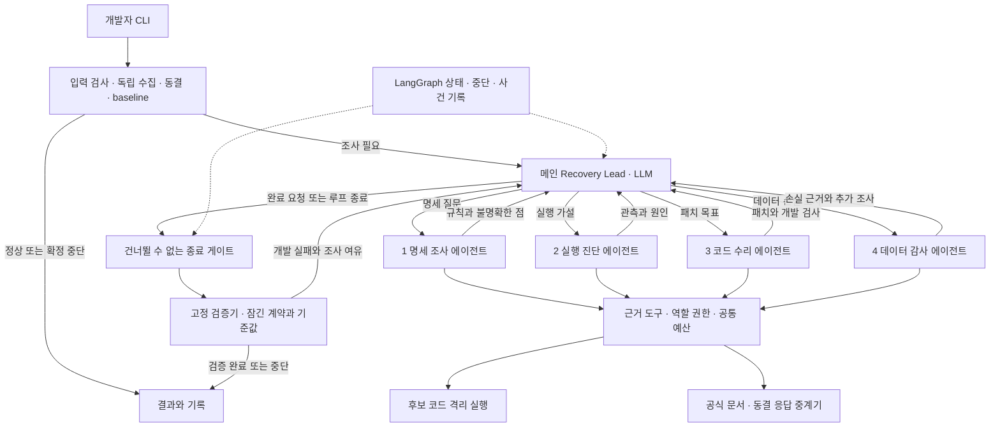
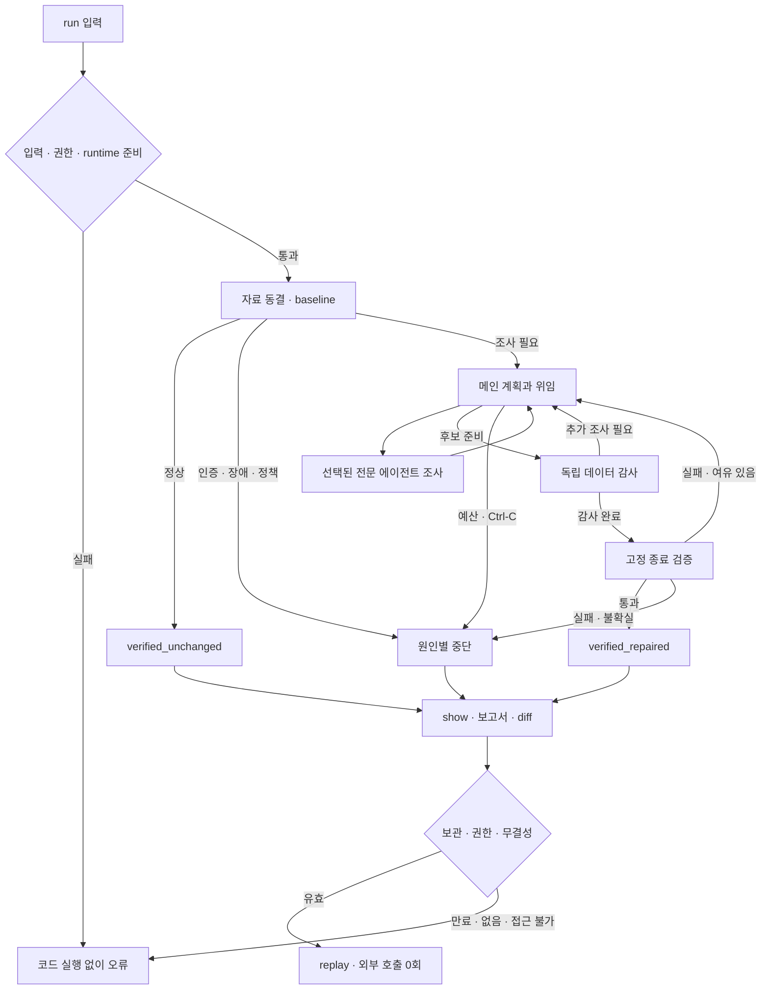

# API닥터 — 메인 에이전트와 4개 전문 에이전트의 공공 API 복구

> **Type**: product-feature
> **Version**: 0.2 · PRD 2안
> **작성일 / 기술 근거 확인일**: 2026-09-27 · Asia/Seoul
> **상태**: 설계 문서. 제품 구현·실제 모델 호출·대회 신청 미실행.
> **대상**: Korea Agentic AI Hackathon 온라인 예선 출품 후보
> **Scale Grade**: Hobby — 로컬 단일 사용자, CLI 우선
> **절대 제약**: 추가 API·데이터·서버·GPU·소프트웨어 지출 0원, 보유 GPU 없음
> **이전 안**: [PRD v0.1](PRD_api-doctor_v0.1.md) · **실행 계획**: [PLAN v0.2](../todo_plan/PLAN_api-doctor_v0.2.md)
> **추가 반영 (2026-09-27)**: OpenShell 차단 기록(FR-021), NAT 프로파일러 P0(FR-018)

## 2안의 핵심 결정

**API닥터는 깨진 공공 API 연결을 복구하기 위해, 메인 에이전트가 네 전문 에이전트에게 필요한 조사·진단·수리·감사를 위임하고 결과에 따라 계획을 바꾸는 개발 도구다.**

메인은 LLM으로 다음 조사와 담당자를 선택한다. 전문 에이전트도 각자 제한된 도구로 증거를 수집하며 가설을 검토한다. LangGraph는 실행 상태와 필수 안전 절차를 관리한다. 최종 데이터 복구 여부는 모델과 분리된 검증기가 판정한다.

등록된 에이전트는 **메인 1개 + 서브 4개**다. 정상 코드나 명확한 인증 오류에는 불필요한 역할을 호출하지 않는다. 네 역할의 실질적 기여는 복합 오류 사례로 입증한다.

| 구성 | 책임 |
|---|---|
| 메인 `recovery_lead` | 현재 문제·증거·예산을 보고 계획, 위임, 결과 충돌 해소, 재계획, 종료 요청 |
| 서브 1 `spec_researcher` | 공식 명세에서 응답·필드·페이지·오류 규칙을 찾아 출처와 모호함 정리 |
| 서브 2 `runtime_diagnostician` | 실제 응답·실행 로그·제한된 실험으로 어디서 왜 실패하는지 진단 |
| 서브 3 `repair_engineer` | 확인된 원인과 계약에 맞춰 연결 코드의 최소 패치 작성 |
| 서브 4 `data_auditor` | 수리 설명과 분리된 관점에서 누락·중복·값 손실 가설을 세우고 추가 검사 선정 |
| 비에이전트 검증기 | 변경 불가능한 기준으로 실행·필드·값·전체성 검사, 최종 판정 |

### 피드백 반영과 1안 대비 변경

입력: [사용자 피드백 HTML](/Users/sangwoo/Downloads/api-doctor-architecture.html). 문서는 읽기만 했으며 원본을 변경하지 않았다.

| 항목 | 1안 / 피드백 제안 | 2안 결정 |
|---|---|---|
| 의사결정 | 단일 수리 에이전트 또는 고정 LangGraph 복구 순서 | 메인 에이전트가 결과를 해석하고 동적으로 다음 위임 결정 |
| 서브에이전트 | 수리 담당 1개를 후속 선택 기능으로 검토 | 역할·도구·산출물이 다른 4개를 핵심 P0로 채택 |
| 문제 범위 | 개별 형식·매핑·페이지 오류 중심 | 같은 지원 API 범위에서 복합 오류와 데이터 손실까지 조사 |
| 사용자 입구 | 웹 화면·세션·CSRF·작업 API | CLI, 터미널 진행 상황, Markdown/JSON 보고서부터 구현 |
| 상태 저장 | SQLite·세션 소유권·tombstone | 로컬 작업 폴더·manifest·JSONL, OS 사용자 권한 |
| Deep Agents | 채택·위임 여부 미정 | 메인의 계획·위임 하네스로 우선 채택, 전문가는 제한된 agent loop |
| 실행 예산 | 8회 / 64k / 300초 | 잠정 24회 / 192k / 600초, 모든 역할·재시도를 한 원장으로 제한 |
| NVIDIA 구성 | 다수 모델·NAT·Guardrails 등 확대 가능 | Nemotron 무료 endpoint + OpenShell 우선. NAT는 평가 확장, 나머지는 필요 입증 후 |
| Skill API | 의미·증빙 미확인 | 자체 API 스킬 산출물과 공식 행사 요건 확인을 별도 항목으로 관리 |
| 격리 대안 | OpenShell 미준비 시 중단 | 동일 경계 검사를 통과한 CPU 컨테이너의 동결 응답 실행을 대안으로 정의 |

피드백에 적힌 특정 버전 실측, 기본 도구 설명 4,500자, 해당 기기의 OpenShell 실행 결과는 **피드백 작성자의 관측**이다. 이번 작업에서 재실행한 결과로 인용하지 않는다. 라이브러리 버전과 계정 한도는 Phase 0에서 고정한다.

## 0. 해커톤 배경과 출품 조건

### 0.1 어느 해커톤인가

| 항목 | 확인 내용 |
|---|---|
| 행사명 | **Korea Agentic AI Hackathon** |
| 안내·접수 | 패스트캠퍼스 NVIDIA 해커톤 페이지 및 연결 신청서 |
| 행사 방향 | 목표를 받아 계획하고 도구를 활용해 문제를 해결하는 Agentic AI |
| 예선 문구 | NemoClaw·OpenShell 교육 미션 확인 후 Build NVIDIA의 Skill API를 활용한 에이전트 데모 개발·제출 |
| 팀 | 최소 2명, 최대 5명. 실제 팀 구성 미정 |
| 다음 단계 | 본선 10팀 선정, 현장 미션 후 상위 5팀 쇼케이스 |
| 본선 자원 | 선발팀에 최대 $1,000 Brev GPU 크레딧·L40S 1대 안내. 예선 자원으로 전제하지 않음 |

행사 조건은 v0.1 작성 시 2026-09-27 확인한 [공식 행사 페이지](https://fastcampus.co.kr/NVIDIA_hackathon), [예선 상세 이미지](https://cdn.day1company.io/prod/uploads/202609/175812-1931/group-2086389378.webp), [본선 상세 이미지](https://cdn.day1company.io/prod/uploads/202609/132914-277/group-2086389354.webp)의 확인 기록을 승계한다. 2안 작성 중 행사 URL도 재열람했으나 로그인 이후 신청서와 교육 내용은 확인하지 않았다.

### 0.2 일정과 미확정 조건

| 단계 | 공개 표기 | 준비 기준 |
|---|---|---|
| 온라인 예선 | 09.11–09.28, 같은 상세 이미지 일부에는 09.11–10.02 | **2026-09-28 우선 준비**, 정확한 마감 시각·연장 여부 미확인 |
| 본선팀 발표 | 10.02 | 참가 공지로 최종 확인 |
| 오프라인 본선 | 10.07, 현장 미션 당일 공개 | API닥터의 본선 주제 인정 여부를 미리 가정하지 않음 |
| AI Day Seoul | 단계 카드 11.09–11.10, 상세 쇼케이스 11.10 | 행사 기간과 팀 발표일 구분 |

출처: 위 상세 이미지와 [예선 카드](https://cdn.day1company.io/prod/uploads/202609/153942-1931/%E1%84%80%E1%85%A2%E1%84%8B%E1%85%AD-01.webp), [쇼케이스 카드](https://cdn.day1company.io/prod/uploads/202609/132654-277/frame-2147239726.webp). 현재 날짜에서 전체 2안 구현을 제출일까지 완성한다고 약속하지 않는다.

### 0.3 Skill API와 참가 적합성

- 현재 공개 문구만으로 “NeMo Framework/Microservices 필수”라고 확정하지 않는다.
- [NVIDIA Build Skills](https://build.nvidia.com/skills)는 공식 에이전트 스킬을 제공한다. **자체 SKILL.md를 만들거나 Nemotron을 호출했다는 사실만으로 행사에서 말하는 Skill API 요건 충족으로 판정하지 않는다.**
- Phase 0에서 [교육 미션](https://learn.nvidia.com/courses/course-detail?course_id=course-v1%3ADLI+S-FX-43+V1) 원문, 지정 API·스킬·사용 증빙, 수료 의무, 신청 형식, 정확한 마감, 참가·교육 비용을 확인한다.
- 공식적으로 요구하는 사용 경로와 자체 API 스킬을 따로 기록한다. 적합한 공식 스킬을 사용한다면 이름·버전·출처·실제로 수행한 행동을 남긴다. 관계없는 스킬을 참가 실적용으로 호출하지 않는다.
- 2–5명 팀 구성 및 실제 주제 적합성은 미확인이다. 이 문서는 참가 신청이나 적격 판정이 아니다.

### 0.4 기술 사용을 설명하는 방식

Nemotron은 메인과 전문 에이전트의 판단에 사용하고, OpenShell은 생성된 연결 코드의 실행 경계를 담당한다. 자체 공공 API 스킬은 명세 탐색·오류 조사 절차를 재사용한다. OpenShell의 차단 기록은 격리가 실제로 작동했다는 증거로 보고서에 연결한다. NAT 프로파일러는 main과 네 역할의 호출·토큰·시간을 측정한다. 기술 이름보다 **실제 입력·행동·도구 결과·제한·출력**을 제출 자료로 남긴다.

## 1. Overview

### 1.1 Problem Statement

API 연결 장애는 단일 예외 수정으로 끝나지 않을 수 있다. 코드를 실행되게 고쳤어도 필드가 사라지거나 첫 페이지만 가져오면 사용자에게 필요한 데이터는 복구되지 않는다. 문서와 실제 응답이 다르게 보일 때는 명세 해석, 실행 원인 진단, 구현, 데이터 보존 검토를 왕복해야 한다.

**문제 가설**: 이 조사 관점을 분리하고 메인이 근거를 종합하면, 하나의 긴 수정 대화에서 발생하는 성급한 결론과 데이터 누락을 줄일 수 있다. 실제 사용자 시간 절감·멀티에이전트 우위는 아직 측정하지 않았다.

### 1.2 Goals

1. 메인이 증거에 따라 담당자·질문·재시도·중단을 선택하는 복구 과정을 구현한다.
2. 네 전문 역할이 각각 독립된 판단과 도구 사용을 수행하도록 한다.
3. 응답 형식·필드 매핑·페이지 처리의 개별 오류와 복합 오류를 지원 범위 안에서 복구한다.
4. 실행 성공과 원래 조회 계약의 데이터 복구 성공을 구분한다.
5. 패치, 근거, 담당자별 기여, 검증 결과, 호출·시간 사용량을 재현 가능하게 제공한다.
6. 추가 지출 0원·GPU 없음 제약을 유지한다.

**설명 한 문장**: “공공 API 연결이 깨지면 전문 에이전트 팀을 지휘해 원인을 밝히고, 코드를 고쳐, 데이터가 빠짐없이 복구됐는지 확인하는 에이전트.”

### 1.3 Non-Goals

- 임의 API·저장소·언어를 자동 지원하거나 공식 문서 없이 정답을 추정하는 범용 수리.
- 모든 작업에서 4명을 한 번씩 호출하는 시연용 고정 순서, 에이전트끼리 무제한 토론.
- 원본 프로젝트 덮어쓰기, 자동 PR·배포·공공 API 서버 변경.
- 인증 우회, 유료 자동 전환, GPU 임대·학습·상시 SaaS 운영.
- 모델 합의로 성공 확정, 테스트·정답·계약을 바꿔 통과시키기.
- P0 웹 서버·회원가입·세션·MCP·네트워크 공유, 자동 재개.
- 이미지 이해, PDF 전용 RAG, 모델별 역할 분배, 대량 합성 데이터 생성.

### 1.4 Scope

| 구분 | P0 범위 |
|---|---|
| 사용자·입구 | 로컬 개발자 1명, CLI·터미널·로컬 보고서 |
| 입력 | 지원 dataset_id, 불변 조회 조건, 단일 Python 연결 파일, 선택 로그 |
| 인터페이스 | `fetch_records(http, query) -> list[dict]`. 임의 프로그램 진입점은 제외 |
| 데이터 | 서울 공공도서관 범위 조회 우선 후보, KOSIS 필드 매핑 후보 |
| 오류 | 형식·필드·페이지 오류와 그 조합. 인증·한도·제공기관 장애는 중단 분류 |
| 팀 | 메인 1 + 명세/진단/수리/감사 4, P0 필수 |
| 출력 | 후보 코드·diff·구조화 보고서·근거·역할별 사건 기록 |
| 변경 | 복사한 단일 연결 파일만. 원본과 검증 영역은 변경 불가 |
| 실행 자료 | 동결된 공개 응답 기본, 무료 live 수집은 조건 확인 후 명시 선택 |

**예선 최소 시연**도 1+4 구조를 사용한다. 지원 API 1종의 복합 결함 1건과 정상/인증 오류 중 1건, 위임·재계획 기록을 목표로 한다. API 2종·전체 평가 세트는 전체 P0 목표다. 일정이 부족하면 실제 완성 범위를 공개한다.

### 1.5 왜 네 전문 에이전트인가

| 역할 | 답해야 하는 질문 | 독립적으로 탐색할 이유 | 없을 때 생기는 구체적 위험 |
|---|---|---|---|
| 명세 조사 | 어떤 응답·조회 규칙을 따라야 하나? | 여러 공식 문단·예시의 충돌, 버전·조건 차이를 좁힘 | 눈앞 응답에만 맞춰 코드를 고침 |
| 실행 진단 | 코드의 어느 지점에서 손실·실패가 발생하나? | 로그·중계기 응답·기존 코드의 다른 관측을 실험으로 대조 | 인증 장애를 파싱 오류로 오인 |
| 코드 수리 | 계약을 보존하면서 무엇을 최소로 바꾸나? | 가설을 코드 변경으로 옮기고 실행 피드백을 반영 | 설명만 있고 실행 가능한 패치가 없음 |
| 데이터 감사 | 실행된 뒤에도 무엇이 사라질 수 있나? | 수정자의 설명을 보지 않고 경계·중복·null·필터 조건의 손실 가설을 조사 | 종료 코드 0·일부 표본만 보고 복구로 착각 |

메인은 이 네 관점의 근거 충돌을 다룬다. 예를 들어 “파싱 오류”라는 진단과 “인증 오류도 XML로 온다”는 명세 근거가 만나면 수리보다 인증 상태 확인을 먼저 위임한다. 쉬운 오류에서는 네 역할의 비용이 이득보다 클 수 있으므로 선택적으로 호출하고 비교 평가로 한계를 밝힌다.

## 2. User Stories

### 2.1 Primary User

| ID | 사용자 이야기 |
|---|---|
| US-01 | As a 공공 API 개발자, I want to 깨진 연결의 원인을 근거와 함께 진단받고 so that 문서·응답·코드를 직접 오가는 시간을 줄인다. |
| US-02 | As a 공공 API 개발자, I want to 수정 뒤의 누락과 값 손실도 확인하고 so that 실행됐다는 이유만으로 잘못된 데이터를 쓰지 않는다. |
| US-03 | As a 공공 API 개발자, I want to 다음 조사와 담당자가 결과에 따라 바뀌고 so that 복합 오류에도 적절한 조사가 이어진다. |
| US-04 | As a 로컬 사용자, I want to 무료 한도·권한·시간 경계에서 멈추고 so that 비용과 원본 파일을 보호한다. |
| US-05 | As a 해커톤 참가자, I want to 실제 위임과 검증 기록을 제시하고 so that 에이전트 구조의 필요성을 설명한다. |

### 2.2 Acceptance Criteria

아래는 아직 실행하지 않은 수용 기준이다. 역할별 모델 결정 기록은 짧은 행동 근거이며 내부 추론 전문을 요구하지 않는다.

```gherkin
Scenario: AC-01 메인과 정확히 네 전문 역할 (US-03)
  Given 메인과 네 전문 에이전트가 초기화되었을 때
  When 런타임의 위임 대상과 실제 도구 권한을 확인하면
  Then 등록된 위임 대상은 spec_researcher, runtime_diagnostician, repair_engineer, data_auditor뿐이다
    And 기본 general-purpose, 동적 생성, 하위 재위임은 사용할 수 없다

Scenario: AC-02 복합 오류 복구와 역할별 기여 (US-01, US-02, US-05)
  Given 범위 조회와 중첩 응답이 확인된 공개 API fixture에 두 결함을 주입했을 때
  When 메인이 필요한 조사와 수리를 위임하면
  Then 네 역할은 각각 근거가 있는 전문 산출물을 반환한다
    And 수정 후보는 원래 필드와 전체 레코드 계약을 고정 검증기에서 만족해야 성공이다
    And 한 역할이 이름만 등장하거나 고정 문구만 반환하면 이 수용 기준은 실패다

Scenario: AC-03 결과에 따른 재계획 (US-03)
  Given 진단은 형식 오류를 의심하지만 명세 근거가 인증 오류 응답 가능성을 보일 때
  When 메인이 두 결과를 받으면
  Then 추가 진단 또는 중단을 선택할 수 있고 모든 사례에 같은 수리 순서를 강제하지 않는다
    And 위임 질문·근거 ID·계획 변경 이유를 기록한다

Scenario: AC-04 독립 감사와 검증기 분리 (US-02)
  Given 후보는 실행되지만 감사자가 경계 페이지 누락 가설을 세웠을 때
  When 허용된 probe에서 손실이 확인되면
  Then 메인은 추가 수리를 위임하거나 판정을 보류한다
    And 감사자의 찬성만으로 verified 상태를 만들 수 없다
    And 감사 입력에 수리자의 설명·비공개 정답·평가 결과를 넣지 않는다
    And completed와 빈 findings만 반환하거나 현재 후보의 실제 감사 probe 증거가 없으면 MISSING_AUDIT로 거절한다

Scenario: AC-05 이미 정상인 코드 (US-04)
  Given 최초 격리 실행과 고정 계약 검증이 모두 통과한 원본이 있을 때
  When baseline 게이트가 완료되면
  Then 모델과 전문 에이전트를 호출하지 않고 verified_unchanged로 종료한다

Scenario: AC-06 인증 만료 또는 한도 소진 (US-04)
  Given 신뢰된 응답 분류가 인증 만료 또는 무료 한도 소진을 확인했을 때
  When 런타임이 그 결과를 받으면
  Then 코드 수리나 유료 전환 없이 종료한다
    And 키는 모델·후보 코드·보고서에 전달하지 않는다

Scenario: AC-07 권한 부족과 도구 위조 (US-04)
  Given 명세 조사자가 파일 변경을 요청하거나 모델이 role 값을 수리자로 위조했을 때
  When 도구 게이트가 요청을 받으면
  Then 프롬프트와 무관한 실행 컨텍스트 권한으로 차단한다
    And 고정 계약·정답·원본 파일은 변경되지 않는다

Scenario: AC-08 예산과 취소 (US-04)
  Given 전체 예산이 소진되거나 사용자가 Ctrl-C를 입력했을 때
  When 다음 위임 또는 도구 실행이 요청되면
  Then 새 호출을 차단하고 실행 중 작업을 정리하며 부분 기록을 저장한다
    And 다른 에이전트로 바꿔도 예산이 초기화되지 않는다
    And 최종 검증 실패 후 재계획하려면 추가 감사와 새 종료 검증의 실행 슬롯을 다시 확보해야 한다

Scenario: AC-09 검증 우회 방지 (US-02)
  Given 메인이 완료를 주장하거나 후보가 빈 배열·고정값을 반환할 때
  When 종료 절차를 수행하면
  Then 고정 게이트를 거치지 않은 후보는 verified가 될 수 없다
    And 다른 입력과 기대 데이터에서 틀리면 검증 실패로 남는다

Scenario: AC-10 격리 실패와 대체 실행 (US-04)
  Given OpenShell이 준비되지 않았을 때
  When 경계 검사를 통과한 CPU 컨테이너 대안을 선택하면
  Then 네트워크 없는 fixture 작업만 허용하고 실제 backend를 기록한다
    And 어떤 격리 환경도 검증되지 않았으면 호스트에서 대신 실행하지 않는다

Scenario: AC-11 만료·권한 없는 기록 열람 (US-05)
  Given 작업 보관 기간 7일이 지났거나 현재 OS 사용자에게 읽기 권한이 없을 때
  When show 또는 replay를 실행하면
  Then 각각 EXPIRED 또는 PERMISSION_DENIED를 반환하고 내용을 출력하지 않는다
    And 삭제가 끝나 파일이 없으면 NOT_FOUND로 반환한다

Scenario: AC-12 외부 의존성 없는 재생 (US-05)
  Given 보관 기간 내 완료된 run_id가 있고 모델키·공공 API키·실행기가 없을 때
  When replay를 실행하면
  Then 저장 기록만 보여주며 모델·API·코드 실행은 0회다
    And replay 표기와 원래 시각·판정이 함께 나타난다

Scenario: AC-13 stale 패치와 감사 의견 충돌 (US-02, US-03)
  Given v1 후보에 대한 결과가 v2 후보 생성 뒤 도착하거나 감사 의견이 도구 결과와 다를 때
  When 메인이 결과를 받으면
  Then 이전 hash의 결과를 최신 검증으로 재사용하지 않는다
    And 사실 확인 도구의 결과를 우선하고 해소되지 않은 계약 관련 우려는 보류한다

Scenario: AC-14 대표 데이터가 실행 중 변경됨 (US-02)
  Given live 수집의 페이지별 총건수 또는 버전이 바뀌었을 때
  When 신뢰된 수집기가 전체성을 확정할 수 없으면
  Then verification_inconclusive로 끝내고 일부 수집을 전체 복구로 표시하지 않는다

Scenario: AC-15 격리 차단의 실제 증거 (US-04, US-05)
  Given OpenShell backend에서 후보 코드가 허용 밖 호스트 연결 또는 작업 폴더 밖 쓰기를 시도할 때
  When 후보를 실행하면
  Then 해당 동작은 차단되고 policy_blocked로 종료한다
    And 보고서의 policy_denials에 목적지·binary·사유·시각이 run_id와 함께 남는다
    And 차단 기록을 수집하지 못하면 차단 성공을 주장하지 않고 증거 없음으로 표시한다
    And 컨테이너 대안 backend의 결과를 OpenShell 차단 증거로 표시하지 않는다

Scenario: AC-16 역할별 사용량 관측 (US-05)
  Given 대표 복합 사례를 NAT 프로파일러를 켜고 실행했을 때
  When 프로파일 결과와 공통 gateway 원장을 비교하면
  Then main과 네 전문 역할 각각의 모델 호출 수·토큰·지연이 산출된다
    And 역할별 호출 수 합계가 gateway 원장과 일치한다
    And 역할 구분이 안 되거나 합계가 다르면 차이와 원인을 보고서에 적고, 예산 판단은 gateway 원장을 따른다
```

### 2.3 User Roles

| Role Key | 한국어 명칭 | 권한 범위 |
|---|---|---|
| operator | 로컬 실행 사용자 | 자신의 OS 권한으로 생성한 작업 실행·조회·재생·삭제·취소 |

에이전트 ID는 서비스 내부 권한 주체이며 사용자 Role Key가 아니다. 웹 계정·관리자·팀 공유 기능은 P0에 없다.

## 3. Functional Requirements

P0 Must / P1 Should / P2 Could / P3 Won't. FR은 v0.2에서 재정의하며 v0.1과 번호별 대응을 가정하지 않는다.

| ID | Requirement | Priority | Dependencies |
|---|---|---|---|
| FR-001 | 지원 데이터셋·명세·불변 조회 계약·정답·fixture·출처를 버전 있는 레지스트리에 등록한다. | P0 | 없음 |
| FR-002 | 5개 agent_id와 정확히 4개 위임 대상, 역할별 도구·산출물 스키마를 등록한다. | P0 | 없음 |
| FR-003 | 모든 역할의 호출·토큰·시간·API·실행 예산을 공통 gateway에서 제한한다. | P0 | FR-002 |
| FR-004 | 비밀키 분리, 공식 데이터 중계기, 문서 접근, CPU 격리·파일 권한을 강제한다. | P0 | FR-001, FR-003 |
| FR-005 | CLI 입력·코드·쿼리·로그 크기·비밀값·지원 인터페이스를 검사한다. | P0 | FR-001, FR-004 |
| FR-006 | 원본을 격리 실행하고 기준 수집기와 검증기가 baseline을 판정한다. | P0 | FR-004, FR-005 |
| FR-007 | 메인이 계획·질문·담당자·근거 충돌·재계획·종료 요청을 모델로 결정한다. | P0 | FR-002, FR-003, FR-006 |
| FR-008 | 명세 에이전트가 공식 근거와 규칙·모호함을 탐색하여 반환한다. | P0 | FR-007, FR-016 |
| FR-009 | 진단 에이전트가 로그·응답·제한된 원본 실험으로 원인 가설을 확인한다. | P0 | FR-007 |
| FR-010 | 수리 에이전트만 지정 후보 파일에 최대 2개 패치 버전을 생성한다. | P0 | FR-007 |
| FR-011 | 감사 에이전트가 독립 컨텍스트에서 데이터 손실 가설을 만들고 허용 probe를 선택한다. | P0 | FR-007 |
| FR-012 | 최종 종료 게이트가 동일 후보 hash의 고정 검증·필수 감사 범위·미해결 우려를 확인한다. | P0 | FR-006, FR-010, FR-011 |
| FR-013 | 비복구 원인·예산·정책·취소·중단·판정 불가를 구분하고 무한 재시도를 막는다. | P0 | FR-003, FR-007, FR-012 |
| FR-014 | 작업·위임·증거·패치·검사·예산을 append-only 사건과 manifest로 저장한다. | P0 | FR-002, FR-003 |
| FR-015 | CLI run/show/replay/delete와 diff·보고서를 제공한다. replay는 외부 호출 0회다. | P0 | FR-013, FR-014 |
| FR-016 | 공공 API 조사 스킬과 출처 manifest를 만들고 공식 Skill API 요건과 구분한다. | P0 | FR-001 |
| FR-017 | 복합 사례, 중단 사례, 역할별 기여 및 단일 에이전트 baseline 비교를 평가한다. | P0 | FR-012, FR-014, FR-015 |
| FR-018 | NAT 프로파일러로 1+4 팀 실행의 역할별 모델 호출·토큰·지연과 도구 구간을 측정하고 보고서·Gantt 차트를 산출한다. 공통 예산 gateway 원장과 대조한다. | P0 | FR-003, FR-014, FR-017 |
| FR-018b | NAT 평가기(`nat eval` evaluator)에 고정 검증기를 연결해 평가 세트를 실행한다. | P1 | FR-017, FR-018 |
| FR-019 | 별도 후속 명세와 접근 제어를 갖춘 NAT UI 또는 웹 입구를 제공한다. | P2 | FR-015, FR-018 |
| FR-020 | 임의 저장소 수정, 자동 PR/배포, 결제·GPU 임대·유료 fallback을 제공한다. | P3 | 제외 |
| FR-021 | OpenShell 정책(버전·hash 고정)으로 후보 실행의 네트워크·파일·프로세스를 제한하고, 차단 기록(목적지·binary·사유·시각)을 수집해 run의 events.jsonl과 보고서의 `policy_denials`에 연결한다. | P0 | FR-004, FR-014 |

### 3.1 데이터 확보와 대표 문제

기존 검토의 무료 데이터 후보를 유지한다. [서울 공공도서관 현황정보](https://data.seoul.go.kr/dataList/OA-15480/A/1/datasetView.do)의 실제 서비스명·필드·범위 조회·HTTPS·키 한도, [KOSIS](https://kosis.kr/openapi/community/community_0401List.do)의 선택 통계표와 필드·키 조건을 Phase 0에서 정상 호출로 확인한다. 이번 문서 작성에서 키를 발급하거나 호출하지 않았다.

정상 코드·공개 응답을 먼저 확보하고 클라이언트에 의도적으로 결함을 주입한다. 페이지 기능은 실제 지원이 확인된 데이터에만 적용한다. 제공기관이 실제 장애나 스키마 변경을 일으켰다고 설명하지 않는다. 수집 범위는 전체 서비스가 아니라 **명시된 query의 전체 결과**다.

대표 데모는 “중첩 응답 경로를 잘못 읽고 마지막 페이지 종료 조건도 틀려 일부 레코드가 빠지는 코드”로 한다. 정확한 필드명·건수는 실제 수집 뒤 정하며 문서 예시 숫자를 실데이터처럼 쓰지 않는다.

- 명세 조사: 페이지 범위·종료·중첩 필드의 공식 규칙 확인.
- 실행 진단: 최초 오류와 그 뒤 감춰진 손실 지점을 최소 실험으로 확인.
- 코드 수리: 두 규칙을 보존하는 최소 수정. 첫 시도에서 모두 고쳤다면 재수리를 강제하지 않음.
- 데이터 감사: 경계 범위·순서 변화·중복 등의 추가 손실 가능성 조사.
- 메인: 필요에 따라 추가 규칙 확인·재진단·두 번째 수리 중 선택하고 종료 요청.

### 3.2 검증 계약과 감사의 경계

1. 등록 시 사람이 검토한 기준 변환과 신뢰된 수집기가 조회 범위, 필수 필드·타입, 식별 키, 값 의미, 기대 ID·건수를 확정한다. 모델은 이를 만들거나 바꾸지 않는다.
2. 작업 시작 시 contract/query/snapshot hash를 잠근다. 후보가 요청한 페이지 목록으로 정답 범위를 축소하지 않는다.
3. live 경로도 신뢰된 수집기가 후보와 독립적으로 필요한 응답을 먼저 모아 동결한다. 현재 작업의 후보 실행은 그 스냅샷을 사용한다. 보고서는 수집 시각 기준 검증임을 명시한다.
4. 동결 세트에는 주 query와 사전에 등록한 개발 probe용 응답을 포함한다. 사용자 코드에 전체 원본 파일·기대값을 마운트하지 않고 중계기 요청 단위로 제한된 원문만 반환한다.
5. 고정 검증기는 모든 필수 항목을 매번 검사한다. 감사자가 선택한 probe는 추가 조사이며 필수 검사 수를 줄일 수 없다.
6. 감사자는 사전 검토된 probe catalog에서 ID와 허용 파라미터를 선택한다. 기대값을 생성하거나 임의 테스트 Python을 쓰지 않는다. 새로운 검사 아이디어는 다음 계약 버전의 제안으로만 기록한다.
7. 주 query의 범위는 그대로 두고, 개발 probe의 필터·페이지 크기·순서를 변경할 수 있다. 해당 변형에 대응하는 검토된 응답·기대값이 없으면 실행하지 않고 unsupported_probe를 반환한다.
8. 고정 검증 통과 + 현재 후보 감사 완료 + 계약 관련 미해결 증거 없음일 때만 verified_repaired가 가능하다. 감사의 주관적 “좋음”은 성공 근거가 아니다.
9. 감사가 계약과 무관한 확장 아이디어만 내면 범위 밖 제안으로 기록한다. 계약의 유효성·의미가 틀릴 수 있다는 해소되지 않은 근거는 verification_inconclusive다. 메인 동의로 덮지 않는다.
10. 0건은 원래 query·기준 원문이 0건을 정당화할 때 정상이다. 예외 무시·null을 임의 0으로 대체·고정 결과 반환을 성공 처리하지 않는다.

**감사의 독립성은 다른 모델을 쓴다는 의미가 아니다.** 같은 무료 모델을 사용하더라도 수리 설명·전체 대화를 숨기고, 감사 전용 데이터 접근과 조사 책임을 둔다. 같은 모델의 상관된 실수는 가능하며 고정 검증이 이를 보완한다.

**런타임이 확인할 감사 완료 조건**:

- 등록 계약의 `audit_requirements`에 해당 query의 위험 영역을 선언한다. 예: 매핑 보존, 범위/페이지 경계. 지원하지 않는 위험 영역을 일괄 요구하지 않는다.
- 감사자는 각 필수 위험 영역에 대해 가설, 적용 불변식, 관측 evidence_id, 실제 probe_result_id, 결론(`no_issue | issue | inconclusive`)을 반환한다. 빈 findings·찬성 문구만으로는 완료되지 않는다.
- 최소 1개 이상의 baseline과 다른 catalog probe를 **현재 candidate_hash + snapshot_hash**에서 감사 호출로 실행해야 한다. probe catalog의 고정 coverage metadata를 합쳐 필수 위험 영역을 모두 커버해야 한다. 하나의 probe가 여러 영역을 커버할 수 있다.
- 어떤 probe와 허용 변형을 택할지는 감사자가 판단한다. 런타임은 probe 실행 사실·버전·coverage·검사 결과·미해결 항목만 확인하며 LLM의 주장만으로 검사를 통과시키지 않는다.
- 패치가 바뀌면 이전 감사는 만료된다. 같은 hash의 정상 원본을 baseline에서 바로 종료하는 verified_unchanged 경로에는 감사가 필요 없다.
- 부족하면 MISSING_AUDIT로 main에 보완을 요청한다. 새 probe 실행 또는 위임 예산이 없으면 verified 대신 verification_inconclusive 또는 해당 예산 중단 상태다.
- 계약 관련 issue를 해결하려면 새로운 probe의 검사 결과와 해당 finding의 연결이 필요하다. 새로운 증거 없이 main이 resolved라고 쓰면 거절한다. scope 밖 분류도 registry의 지원 범위로 확인하며, 범위 판단 자체가 모호하면 보류한다.

### 3.3 종료 상태

실행 중 `status`는 accepted/running/cancelling, `stage`는 prepare/baseline/delegating/checking/finalizing으로 구분한다. 현재 담당자는 active_agent_id와 task_id로 표시한다. stage는 기술적 진행 표시이며 전문 역할의 고정 호출 순서를 의미하지 않는다. 종료 시 아래 status 중 하나를 기록한다.

| 상태 | 의미 |
|---|---|
| verified_repaired | 후보가 고정 검증과 최종 종료 조건을 만족 |
| verified_unchanged | 원본 baseline이 이미 계약을 만족, 수정·모델 호출 없음 |
| needs_user_action | 인증·지원 입력·명세 확정 등 사용자 조치 필요 |
| external_unavailable | 공급자 장애·수집 실패로 진행 불가 |
| budget_exhausted | 계정 무료 범위 또는 로컬 호출·토큰·시간 등 상한 소진 |
| policy_blocked | 권한·격리·접근 정책 위반 |
| verification_failed | 확정된 후보가 기준을 어김, 허용 수정이 끝남 |
| verification_inconclusive | 정답 범위·데이터 일관성·감사 쟁점을 확정할 수 없음 |
| cancelled / interrupted | 사용자 취소 / 프로세스 중단. 성공 승계 없음 |

라이브러리 오류·무효 구조화 응답이 재시도 후 남으면 needs_user_action에 `agent_protocol_error` 이유를 붙인다. 신뢰된 시스템은 인증·정책·예산 오류를 모델 판단보다 먼저 중단한다. 강제 중단이 발생하면 완료된 일부 검사가 있어도 전체를 verified로 승격하지 않는다.

replay는 새 복구 작업이 아니라 표시 명령이다. `display_mode=replay`, `original_status`, `original_created_at`를 제공한다.

## 4. Non-Functional Requirements

### 4.0 Scale Grade

**Hobby** — 기존 컴퓨터 1대, 로컬 사용자 1명, 동시 복구 작업 1개. 1+4는 전문 역할의 수이며 서버 5대나 별도 유료 모델 5개를 의미하지 않는다.

### 4.1 Performance와 공유 예산

다음은 설계 상한이며 실측치가 아니다. 공급자의 무료 한도가 더 낮으면 항상 낮은 한도를 적용한다. Phase 0에서 한 바퀴 실제 사용량을 측정한 후 문서·설정·평가를 함께 고정한다.

| 항목 | P0 목표 / 상한 |
|---|---|
| 작업 동시성 | 1개, 프로세스 간 로컬 잠금. 대기열 없이 BUSY |
| 모델 동시성 | 1개. 메인이 독립 업무 둘을 요청해도 gateway에서 순차 실행 |
| 전체 시간 | 600초 후 새 작업 차단·정리 시작. 정리 최대 5초 |
| 모델 호출 | 전체 최대 24회. main 최대 8회, 각 전문 역할 최대 4회, 역할 간 양도 없음 |
| 모델 토큰 | 전체 누적 입력+출력 192,000 예산, 호출 전 입력·최대 출력 예약 |
| 회당 문맥 | 시스템·도구 설명 포함 입력 목표 최대 8,000토큰. 초과 자료는 명시적 발췌 |
| 회당 출력 | main/명세/진단/감사 최대 2,048, 수리 최대 4,096. reasoning 포함 상한 동작 검증 필요 |
| 위임 | 전체 최대 8개, 각 역할 최대 2회. 한 위임 안 모델 왕복도 역할별 4회 한도에 포함 |
| 패치 | 최대 2개 버전. 패치 생성·적용 1회가 한 시도이며 실행 결과 후 수정도 새 버전 |
| 후보 실행 | 전체 합계 8회. baseline 1회, 개발/감사/최종 검증이 나머지 7회를 공유하며 종료용 최소 1회 예약 |
| 격리 실행 | 실행당 15초, CPU 1코어·메모리 512MiB·프로세스 32개 상한 목표 |
| 공식 데이터 호출 | 작업 전체 최대 20회. 기준 수집·개발 probe 자료·재시도 포함 |
| 공식 문서 | 최대 3문서, 추출 텍스트 각 100KB. 모델에는 필요한 절만 제공 |
| 다운로드 | 응답당 2MB, 작업 누적 20MB. 초과하면 전체성 추정 없이 중단 |
| 입력 크기 | Python 1파일 100KB, 로그 100KB, query 8KB. 압축 파일 제외 |
| 로컬 표시 | 외부 호출 없는 show/replay 최초 출력 p95 500ms 이하, 보관 작업 50개 기준 |
| 진행 출력 | 사건 기록 확정 후 1초 이내 터미널 표시 목표 |
| 취소 | Ctrl-C 후 2초 내 새 호출 차단, 5초 내 실행 프로세스 정리 목표 |

**예산의 단위**: 역할 1회 위임은 모델 1회 호출과 다르다. 예를 들어 main 5 + 명세 2 + 진단 3 + 수리 3 + 감사 2 = 15회가 될 수 있다. 이는 산정 예시이며 실제 성공 호출 수를 보장하지 않는다.

- 모든 SDK 요청·자동 재시도·구조화 출력 재시도·요약·보조 모델은 동일 gateway를 통과한다. P0에서는 자동 요약·암묵적 재시도를 끄고 필요한 재시도를 계측한다.
- 각 위임은 현재 남은 전체·역할별·시간 예산의 작은 값을 받는다. 하나를 끝내도 예산을 재설정하지 않는다.
- 호출 전 토큰을 보수적으로 예약하고 반환된 usage로 정산한다. usage가 없으면 예약량을 반환하지 않고 `estimated`로 표시한다. reasoning 한도를 포함해 제공자별 상한이 계측되지 않으면 정확한 토큰 상한 준수를 주장하지 않는다. 호출 수·시간·0원 차단은 별도로 강제한다.
- 토큰 계산기·reasoning 설정·도구 설명 크기는 Phase 0에서 실제 모델과 고정 버전으로 확인한다. 확인되지 않은 `disable reasoning` 파라미터를 가정하지 않는다.
- 새 위임은 종료용 후보 실행 1회와 정리 20초의 여유를 소비할 수 없다. 남은 시간이 부족하면 모델 없이 중단 보고서를 만든다. 최종 검증은 이미 동결된 데이터만 사용해 새 공식 API 호출을 요구하지 않는다.
- 최종 검증을 실행하면 예약 슬롯은 실제 사용 1회로 정산한다. 실패 후 루프에 돌아가기 전에 종료 검증 1회를 다시 예약하고, 새 후보에 필요한 감사 probe의 최소 실행 수와 남은 시간을 확인한다. 이를 확보할 수 없으면 추가 수리 없이 verification_failed 또는 이미 소진된 예산 상태로 끝낸다. 재예약으로 총 8회가 늘어나지 않는다.
- 모델 HTTP 최대 45초, 문서·데이터 요청 10초. 일시 오류 재시도는 같은 역할·전체 한도 안 최대 1회이며 영구 오류·무료 한도에는 재시도하지 않는다.
- 24회는 무료 제공량의 약속이 아니다. 계정 한도가 확인되지 않거나 유료 결제가 필요한 endpoint면 실행하지 않는다.

### 4.2 Availability

상시 가용성 SLA는 N/A — 로컬 명령을 실행할 때만 동작한다. 모델·API 장애는 해당 상태로 중단하고 부분 기록을 보존한다. 기록 replay는 외부 서비스 없이 가능하다. 아직 실제 지연·성공률은 측정하지 않았다.

### 4.3 Data

- 작업 디렉터리는 OS 사용자 전용 `0700`, 개별 파일 `0600`을 기본으로 한다. 기본 보관 기간 7일, CLI 진입 시 만료 검사·정리.
- 삭제 명령은 종료 작업만 즉시 제거한다. 실행 중이면 BUSY와 취소 안내. tombstone·다중 사용자 소유권 DB는 만들지 않는다.
- 7일이 지난 기록은 표시 전에 EXPIRED로 거절하고 정리한다. 정리 이후 같은 ID는 NOT_FOUND다.
- 모델에는 비밀값을 제거한 코드·로그·문서 발췌·공개 응답 표본만 보낸다. CLI 실행 전에 전송 범위를 설명하며, 원문 키가 탐지되면 전송 없이 입력 수정 안내.
- 비밀키는 신뢰된 호스트 broker/model gateway에만 보관한다. 후보 실행·agent prompt·trace·보고서·스킬에 저장하지 않는다.
- 공개 데이터 출처·라이선스·수집 시각·query·hash를 보존한다. 원문 응답을 그대로 재배포할 수 있는지 별도로 확인하고 출처를 표시한다.
- 모델의 내부 추론 전문 대신 위임 질문·짧은 결정 근거·도구 관측·산출물을 기록한다. 외부 유료 관측 서비스는 연결하지 않는다.
- OpenShell 정책 파일은 `policies/sandbox.yaml`로 버전 관리하고 hash를 manifest에 남긴다. 후보 실행에 쓴 정책과 보고서에 적힌 정책은 같은 hash여야 한다.
- 차단 기록은 run 종료 시 `openshell logs`로 수집해 `denials.jsonl`로 저장한다. 요청 경로의 query처럼 비밀값이 섞일 수 있는 필드는 제거한다.
- NAT 프로파일러 산출물(`standardized_data_all.csv`, `workflow_profiling_report.txt`, `gantt_chart.png`)은 run 또는 평가 세트 폴더에 두고, 모델 원문 대화는 저장하지 않는다.

### 4.4 Recovery

RTO 목표 5분: 로컬 실행기를 다시 시작해 기록 확인 가능 상태까지. RPO 목표 마지막 확정 사건 1개 이내. 사건 추가 후 flush, manifest·산출물은 임시 파일 후 원자적 교체한다.

비정상 종료한 실행은 다음 시작 시 interrupted로 마감한다. 자동 재개·모델 재호출은 하지 않는다. 같은 입력을 다시 실행하면 새 run_id를 만들고 기존 결과를 성공으로 승계하지 않는다. 잠금 해제는 프로세스 생존 여부를 확인해 처리한다.

### 4.5 Security와 권한

**사용자 인증·인가**: P0에는 HTTP listener·공유 API가 없다. CLI를 실행한 OS 사용자 `operator`만 자신의 작업 루트에 접근한다. `run_id`는 루트 아래의 정규화된 ID로만 해석하고 절대 경로·`..`·심볼릭 링크로 다른 경로를 읽지 않는다. 입력 파일은 사용자가 지정한 파일을 읽기 전용 복사하며 원본을 import/execute하지 않는다. 역할 ID·task ID는 런타임이 생성하고 모델 인자로 권한을 선택하게 하지 않는다.

**에이전트 권한**: 별도 허용 목록을 도구 게이트와 파일 경계에서 강제한다. 프롬프트는 설명 수단이며 권한 통제 수단이 아니다. 자세한 표는 §5.3.2. main도 숨겨진 정답·키·호스트 shell·후보 쓰기 권한이 없다. 최종 상태를 임의로 쓸 수 없다.

**실행 경계**:

- 코드 실행은 OpenShell 우선. 현재 기기에서 실제 설치·격리 검증은 하지 않았다.
- 대안은 무료 사용 조건과 로컬 CPU 동작이 확인된 컨테이너 엔진. 비특권 사용자, network none, 읽기 전용 rootfs, 모든 capability 제거, no-new-privileges, 자원 상한을 적용한다.
- P0 컨테이너 대안은 fixture 실행만 지원한다. sandbox SDK의 `http` 객체가 좁은 요청/응답 IPC로 broker에 요청하고, broker는 동결 데이터만 반환한다. 후보 안에서 실제 네트워크 연결이나 key 주입을 하지 않는다. IPC는 임의 shell/파일경로 실행을 지원하지 않는다.
- OpenShell live 입력도 host collector가 먼저 수집하고 동결한 뒤 후보를 실행하므로, 후보의 외부 네트워크 권한은 필요 없다. provider 호출은 broker 경계에만 둔다.
- 홈·SSH·Docker socket·키·검증기·정답 디렉터리는 마운트하지 않는다. 후보 작업 폴더 외 쓰기를 막고, stdout·파일 출력 용량을 제한한다. runtime 검사가 하나라도 실패하면 실행을 거절한다.
- 대체 실행이 통과해도 OpenShell을 사용했다고 표시하지 않는다. 행사 요건 충족 여부는 별도다. 양쪽 모두 준비되지 않으면 기존 기록 replay만 가능하다.

**외부 자료·중계기**:

- 고정 dataset endpoint에 허용 GET·query만 허용한다. 인증·URL은 모델이 쓰지 않는다. API key는 공식 HTTPS 경로에서만 주입한다.
- 공식 문서 URL은 레지스트리의 허용 도메인·경로로 제한한다. URL 사용자정보·비표준 포트·사설/루프백/link-local 주소·허용 밖 리다이렉트 차단, 연결 시 DNS 결과 재검사.
- HTTPS 미확인 데이터 소스는 key를 전송하는 live 지원에서 제외하고 출처가 확인된 키 없는 fixture만 사용한다.
- 문서·로그·공공 응답·서브에이전트 메시지는 정책을 바꾸는 명령이 될 수 없다. 위임 입력도 필요한 발췌와 evidence_id로만 전달한다.
- 로컬 스킬은 사전 검토·버전 고정된 자료다. 원격 문서가 스킬 파일을 만들거나 바꾸게 하지 않는다. 자체 스킬에 정답·평가 fixture를 넣지 않는다.
- 보고서의 문자열·경로·제어문자를 정리한다. CLI escape sequence를 제거하고 Markdown에서 원문 HTML을 실행하지 않는 표시 경로를 사용한다.

## 5. Technical Design

### 5.1 API Specification — CLI와 내부 계약

**P0 공개 REST API는 N/A**: 로컬 CLI가 진입점이다. 사용자와 에이전트가 호출하는 경계는 아래 계약으로 정의한다. 후속 NAT serve를 켜는 경우 별도 인가·노출 명세가 선행되어야 하며 이 CLI 계약이 인증을 대신하지 않는다.

#### 5.1.1 CLI

모든 명령의 사용자 주체는 OS 사용자 `operator`. `--json` 결과는 stdout, 진행 출력은 stderr로 분리한다. 실행 중 Ctrl-C는 동일 run의 취소 요청이다.

| Command | Request | Response | Error |
|---|---|---|---|
| `api-doctor datasets` | 없음 | id·지원 오류·스킬/계약 버전·live_ready 목록 | REGISTRY_INVALID |
| `api-doctor run` | dataset·code·query, 선택 log, source와 snapshot | 종료 시 RunResult JSON·artifact 경로 | INVALID_INPUT, UNSUPPORTED_INPUT, PERMISSION_DENIED, BUSY, KEY_REQUIRED, RUNTIME_UNAVAILABLE |
| `api-doctor show <run_id>` | 자신의 작업 ID | manifest·최종 결과·산출물 목록 | NOT_FOUND, EXPIRED, PERMISSION_DENIED, CORRUPT_ARTIFACT |
| `api-doctor replay <run_id>` | 완료 작업 ID, 선택 출력 속도 | 원래 사건 순서·시각·상태. display_mode=replay | NOT_FOUND, EXPIRED, PERMISSION_DENIED, NOT_TERMINAL, CORRUPT_ARTIFACT |
| `api-doctor delete <run_id>` | 자신의 종료 작업 ID | deleted=true | NOT_FOUND, PERMISSION_DENIED, BUSY |

`run` 입력 예시이며 CLI·파일은 아직 구현하지 않았다.

```json
{
  "dataset_id": "registered_library_dataset",
  "code_path": "./broken_connector.py",
  "query": {"scope_id": "registered_scope"},
  "source": "fixture",
  "fixture_snapshot_id": "public_snapshot_example",
  "log_path": null
}
```

`source=fixture`는 model key와 격리 실행기가 필요하지만 public API key는 필요 없다. snapshot이 없으면 SNAPSHOT_REQUIRED. `source=live`는 fixture ID를 받지 않고 공식 API key·HTTPS·수집 범위의 준비를 요구한다. 수집 후 snapshot_id를 생성한다. replay는 이 입력들과 모델·실행기를 요구하지 않는다. 공공 데이터 자동 다운로드를 replay에 숨기지 않는다.

공통 응답:

```json
{
  "run_id": "run_example",
  "status": "verified_repaired",
  "source": "fixture",
  "candidate_hash": "sha256:example",
  "verification": {"contract_version": "example-v1", "gate": "passed"},
  "usage": {"model_calls": 15, "tokens": 85000, "tokens_kind": "actual"},
  "artifacts": ["candidate.py", "patch.diff", "report.md", "report.json", "events.jsonl"],
  "error": null
}
```

숫자·ID는 스키마 예시이며 실측값이 아니다.

```json
{"error":{"code":"RUNTIME_UNAVAILABLE","message":"검증된 실행 환경이 없습니다.","retryable":false},"run_id":null}
```

사용자 표시 문구는 한국어로 구현한다. 종료 코드: 0=verified 또는 성공한 조회·재생·삭제, 2=입력/권한/자료 오류, 3=복구 실패·보류·사용자 조치·외부 장애, 4=예산·정책 차단, 5=BUSY/런타임·내부 오류, 130=사용자 취소. JSON의 status/error를 함께 확인하며 replay의 exit 0은 새 복구 성공이 아니다.

#### 5.1.2 메인 ↔ 전문 에이전트

메인의 위임 요청과 반환은 schema 검사를 통과해야 한다. 요청의 자유 텍스트만으로 도구·예산·계약을 변경할 수 없다.

```json
{
  "task_id": "task_example",
  "agent_id": "data_auditor",
  "objective": "마지막 범위에서 레코드가 누락될 가능성을 조사한다",
  "run_id": "run_example",
  "candidate_hash": "sha256:example",
  "contract_id": "registered-contract-v1",
  "evidence_ids": ["ev_response_1", "ev_dev_check_2"],
  "allowed_probe_ids": ["boundary_range", "page_partition"],
  "budget_lease": {"model_calls": 2, "sandbox_runs": 1},
  "deadline": "runtime_assigned"
}
```

`task_id/agent_id/run_id/hash/contract/allowed_probe_ids/budget_lease/deadline`는 registry와 실행 컨텍스트로 런타임이 검증·발급한다. 모델은 objective·기존 evidence 참조·수신 역할을 제안할 뿐이다. 감사 objective는 자유로운 수리 설명 대신 고정 감사 템플릿으로 다시 구성한다.

공통 반환 필드: `task_id`, `agent_id`, `candidate_hash`, `outcome`, `findings[]`, `evidence_ids[]`, `unknowns[]`, `suggested_next_action`, `artifact_refs[]`, `usage`. outcome은 `completed | need_more_evidence | blocked | failed`; 이것은 최종 제품 판정이 아니다. 근거 ID·artifact hash는 런타임이 존재·권한·버전 검증한다. 형식 재시도 1회도 동일 예산에 포함한다.

| 역할 | 추가 산출물 |
|---|---|
| spec_researcher | 규칙·문서 절·적용 조건·충돌·확인 불가 항목을 담은 spec_findings |
| runtime_diagnostician | 관측된 실패 위치·가설·확인/기각 probe·복구 가능 여부를 담은 diagnosis |
| repair_engineer | 기준 후보 hash·새 hash·diff·근거를 연결한 patch_proposal |
| data_auditor | 가설별 검사·실제 관측·범위 안/밖 구분·미해결 우려를 담은 audit_findings |

#### 5.1.3 공통 도구 API

역할 인가는 호출 컨텍스트로 판단한다. 후보 실행 SDK의 `http`와 에이전트 도구는 별도 경계다.

| Tool | Request → Response | 인가 주체 | 대표 오류 |
|---|---|---|---|
| `read_evidence` | 허용 evidence_id → 발췌·출처·hash | main 및 해당 자료에 접근 가능한 전문 역할 | NOT_FOUND, FORBIDDEN, STALE |
| `search_spec` | 등록 문서·질문 → 문단과 evidence_id | 명세 | UNSUPPORTED_DOC, BUDGET_EXHAUSTED |
| `inspect_code` | original/candidate hash → 읽기 전용 코드·diff | 진단·수리·감사 | FORBIDDEN, STALE |
| `inspect_trace` | run/probe ID → 정제한 요청·응답·오류 | 진단·감사 | FORBIDDEN, NOT_FOUND |
| `run_probe` | 등록 probe_id·대상 hash·허용 query → 관측 결과·개발 검사 요약 | 진단·수리·감사, 역할별 대상 제한 | UNSUPPORTED_PROBE, BUDGET_EXHAUSTED, POLICY_BLOCKED |
| `submit_patch` | base_hash·지정 파일 diff → 새 hash·적용 결과 | 수리만 | STALE, PATCH_LIMIT, FORBIDDEN_PATH, INVALID_PATCH |
| `get_budget` | 없음 → 전체·역할 잔여량 | main·모든 전문 역할 | RUN_TERMINATED |
| `request_finish` | 현재 hash·근거·희망 종료 이유 → 고정 게이트 예약 또는 거절 | main만 | STALE, MISSING_AUDIT, UNRESOLVED_FINDING |
| `request_stop` | 관측 근거·미해결 이유 → 허용된 비성공 종료 상태 | main만 | UNSUPPORTED_REASON, RUN_TERMINATED |

감사·진단이 `run_probe`를 사용해도 코드 쓰기 권한이 생기지 않는다. 진단은 원본 재현·요청 변형, 수리는 자기 후보 개발 검사, 감사는 현재 후보의 감사 catalog로 제한한다. `request_finish`는 성공 상태를 입력받지 않고 최종 검증을 예약한다. `request_stop`은 원인과 근거를 받아 비성공 상태만 확정하며, 이미 발생한 강제 중단 사유를 바꿀 수 없다. 정상 텍스트로 agent loop가 끝나도 런타임은 동일 종료 게이트로 이동한다.

### 5.2 Database Schema — 로컬 작업 기록

P0 관계형 DB는 N/A. 작업 폴더와 다음 버전 있는 JSON 스키마로 같은 무결성을 표현한다. 에이전트에게 이 저장소의 쓰기 권한을 주지 않는다.

| 파일 / 논리 엔터티 | 핵심 필드·무결성 |
|---|---|
| registry | dataset_id, allowed_endpoints, contract_id/hash, skills_manifest, supported_probes 및 coverage, audit_requirements |
| manifest.json / Run | run_id, source, OS owner metadata, status, timestamps, query/contract/snapshot/original/candidate hash, limits, usage, backend |
| events.jsonl / Event | 증가 seq, time, run_id, task_id, agent_id, type, summary, evidence refs, candidate_hash, usage_delta |
| tasks.json / Delegation | task_id, parent=main, agent_id, objective, input refs, lease, status, output refs, candidate_hash |
| evidence manifest | evidence_id, kind=observation/assertion, source, timestamp, hash, visibility, size |
| patch manifest | version 1/2, base_hash, candidate_hash, diff_hash, author=repair_engineer |
| checks manifest | check_id, requesting_agent/task_id, candidate_hash, contract_hash, snapshot_hash, probe_id/coverage, pass/fail/inconclusive, per-check metrics |
| report.json / report.md | final gate 결과·근거·차단 이유·역할별 기여·사용량·데이터 출처 |

원본·후보·수집 원문·검증 기대값·모델용 증거 저장 경로를 분리한다. 모든 결과는 hash로 특정 버전에 연결된다. `observation`은 도구가 기록한 관측, `assertion`은 모델의 주장이다. 존재하는 근거를 인용해도 주장이 자동으로 관측 사실로 승격되지는 않는다.

### 5.3 Architecture

#### 5.3.1 구성과 제어 흐름



메인과 네 서브에이전트만 LLM 판단 주체다. CLI·LangGraph 런타임·예산·broker·sandbox·검증기·NAT는 추가 에이전트로 세지 않는다. LangGraph의 고정 절차는 안전과 결과 무결성을 강제하고, 업무 조사 순서는 메인이 결정한다.

#### 5.3.2 실제 결정권과 도구 권한

| 주체 | 자율 결정 | 허용 도구·자료 | 금지 |
|---|---|---|---|
| main | 조사 순서·담당자·질문·가설 충돌 재조사·수리 요청·중단 요청 | task, 계획 관리, 요약된 근거, budget, request_finish, request_stop | 코드 쓰기·직접 실행·계약 변경·성공 확정 |
| 명세 | 어떤 공식 절·예시를 읽고 어떤 규칙 충돌을 더 확인할지 | search_spec, read_evidence, 해당 API 스킬 | patch·sandbox·API key·기대값 |
| 진단 | 어느 원인 가설을 어떤 작은 원본 실험으로 확인할지 | inspect_code/trace, run_probe, read_evidence | candidate 쓰기·계약 수정·하위 위임 |
| 수리 | 최소 변경·어떤 공개 개발 검사를 실행할지 | inspect_code, submit_patch, 자기 후보 run_probe, 전달된 근거 | 원본·다른 파일·정답 수정·감사 입력 작성 |
| 감사 | 어떤 손실 가설과 등록 probe를 조사할지 | 현재 candidate, 중립 계약 요약, 원문·관측·감사 probe | 수리자의 설명·main 전체 대화·정답·코드 쓰기·성공 확정 |
| 런타임/검증기 | 고정 정책·계약 검사, 완료 상태 기록 | 별도 신뢰 영역 | 모델 지시로 규칙·예산 완화 |

전문가 네 명은 자기 결과를 메인에게만 반환하고 서로 직접 지시하지 않는다. main이 에이전트 산출물을 전달할 때도 상대 역할에 허용된 자료만 보낸다. 감사는 main의 자유 텍스트와 수리 보고서를 상속하지 않고 런타임이 구성한 중립 task envelope만 받는다.

#### 5.3.3 메인의 계획·재계획 규칙

main은 다음 정보를 유지한다: 현재 목표, 확인/기각된 가설, 빠진 근거, 작업 목록, 담당자 상태, 최신 candidate hash, 예산, 미해결 감사 항목. 전체 도구 응답은 하위 컨텍스트와 evidence store에 남기고 필요한 요약만 main에 전달한다.

허용 행동은 `delegate`, `revise_plan`, `request_finish`, `request_stop`이다. 계획 텍스트만 만들고 고정 순서로 전부 실행하는 것은 FR-007 미충족이다. 다음과 같은 서로 다른 경로가 실제 기록으로 관측되어야 한다.

| 관측 | 가능한 main 결정 | 필수 경계 |
|---|---|---|
| 문서 규칙은 명확하지만 오류 위치 불명 | 진단부터 위임 | 처음부터 네 역할 전체 호출 불필요 |
| 명세와 실제 응답 해석 충돌 | 좁힌 질문으로 명세 또는 진단 재위임 | 규칙·기대값을 임의 변경하지 않음 |
| 원인과 복구 목표가 확인됨 | 수리 위임 | 지정 파일·2회 제한 |
| 후보가 실행되며 결과는 그럴듯함 | 독립 감사 위임 | 수리 설명 비공유 |
| 감사가 누락을 확인 | 추가 수리 또는 원인 재진단 | 이전 후보 감사는 새 후보에 재사용 불가 |
| 자료 부족·계약 충돌 지속 | 판정 보류·사용자 조치 요청 | 불확실성을 성공으로 바꾸지 않음 |
| runtime의 인증·무료 한도·정책 차단 | 고정 중단 결과 수용 | 다른 역할로 우회 불가 |

중복 루프 방지: 같은 agent_id·objective 유형·evidence hash·candidate hash로 재위임하면서 새 근거나 구체적 미해결 질문이 없으면 NO_NEW_EVIDENCE로 거절한다. 역할당 2회·전체 8회 상한과 관계없이 이 검사를 먼저 한다. 거절 1회 후에도 같은 요청이면 verification_inconclusive로 종료한다.

고정 게이트는 main의 종료 요청, 일반 텍스트 종료, agent 예외, 루프 상한에서 모두 실행된다. 다만 정책·예산·취소 중단에서는 새 코드를 실행하거나 verified로 승격하지 않고 부분 결과와 종료 상태만 확정한다. 최종 검증 실패 후 main에 돌아가는 개발 루프도 전체 시간·2패치·현재 hash 조건을 만족할 때만 허용한다.

#### 5.3.4 런타임·프레임워크 선택

**우선 구현안**: main은 Deep Agents의 계획·위임 하네스, 네 전문가는 제한된 LangChain agent loop를 `CompiledSubAgent` 등으로 연결한다. 이 팀을 LangGraph 기반 실행 상태와 필수 종료 게이트로 감싼다. main 자체가 모델을 사용하는 supervisor이며 NAT나 StateGraph의 정적 분기표가 업무 판단을 대신하지 않는다.

[LangChain의 supervisor 문서](https://docs.langchain.com/oss/python/langchain/multi-agent/subagents)는 메인이 하위 에이전트를 도구로 호출하고 입력·결과 조합을 결정하는 패턴을 설명한다. [Deep Agents 공식 문서](https://docs.langchain.com/oss/python/deepagents/subagents)는 역할별 도구·격리 컨텍스트·구조화 반환·CompiledSubAgent 구성을 제공한다.

기본 general-purpose 하위 에이전트는 비활성화하고 정확히 네 역할만 등록한다. 전문가에는 task·동적 생성 도구를 제공하지 않는다. 기본 filesystem/shell 도구가 남지 않도록 **초기화 후 실제 tool inventory와 실행 시 권한을 둘 다 검사**한다. 권한·예산 middleware는 하위 에이전트에도 명시적으로 적용한다.

SDK 설정 키와 버전은 아직 고정하지 않는다. Deep Agents에서 필요한 도구 경계를 만족하지 못하면 main도 LangChain `create_agent` 기반 supervisor로 구현할 수 있다. 이 대안도 LLM main + 동일 4개 역할·도구 계약·LangGraph 상태를 유지하며, 단일 에이전트로 조용히 축소하지 않는다. 변경은 Phase 0 기술 결정 기록에 남긴다.

checkpoint는 동일 프로세스 안 상태와 기록에 사용한다. 디스크 checkpoint가 있다는 이유만으로 외부 호출을 자동 재실행하지 않는다.

#### 5.3.5 NVIDIA 사용 범위

| 구성 | v0.2 결정 | 근거·확인할 것 |
|---|---|---|
| Nemotron hosted endpoint | main + 네 전문가에 동일 무료 모델 후보 사용 | [Super 모델 페이지](https://build.nvidia.com/nvidia/nemotron-3-super-120b-a12b)의 free endpoint 표시 확인. 실제 계정 한도·tool roundtrip 미검증 |
| OpenShell | 생성 코드 CPU 실행의 우선 backend + 차단 기록을 제품 증거로 사용 (P0, FR-021) | [공식 저장소](https://github.com/NVIDIA/OpenShell), [정책·차단 기록 문서](https://docs.nvidia.com/openshell/v0.0.116/sandboxes/policies). 차단 기록 필드(host·port·binary·사유·시각)와 `openshell logs` 조회는 문서 확인. 현재 기기에서 자원·파일·IPC·네트워크 경계와 기록 수집 검증 필요 |
| 공공 API SKILL.md | 명세·진단 절차를 묶는 P0 자료 | 자체 산출물. 행사 Skill API 충족 여부는 §0.3에서 별도 확인 |
| NeMo Agent Toolkit | 프로파일러 P0(FR-018), 평가기 연결 P1(FR-018b). 두 번째 supervisor를 만들지 않음 | [LangGraph 연동 문서](https://docs.nvidia.com/nemo/agent-toolkit/latest/run-workflows/existing-agents/langgraph.html), [프로파일러 문서](https://docs.nvidia.com/nemo/agent-toolkit/latest/improve-workflows/profiler.html). `eval.profiler` 설정과 산출물 3종은 문서 확인. main + 하위 에이전트의 역할별 구분 수집은 Phase 0 확인 |
| NAT serve/UI/MCP | P2 이후 | [공식 UI 문서](https://docs.nvidia.com/nemo/agent-toolkit/latest/run-workflows/launching-ui.html)는 서버 뒤 별도 UI 실행 절차를 안내. nat serve 한 번으로 제품 화면·인가가 완성된다고 가정하지 않음 |
| Parse·Embed·Rerank·Nano·Guardrails 모델 | P0 미사용 | 문서량·분류·안전 탐지의 추가 이득이 확인될 때 무료 한도 내 도구로 검토. 새 전문 에이전트를 늘리는 이유로 쓰지 않음 |
| Data Designer | P0 미사용 | 고정 결함 주입과 사람 검토로 소규모 평가 구성 |
| NemoClaw Deep Agents Code | 별도 터미널 제품, P0 필수 런타임 아님 | 자체 SDK 기반 팀이 공식 관리 대상이라고 가정하지 않음 |
| L40S·DGX·로컬 NIM | 예선 설계의 의존성 아님 | 보유 GPU 없이 무료 원격 추론. 본선 자원·현장 미션은 별도 |

[NemoClaw 플랫폼 문서](https://docs.nvidia.com/nemoclaw/user-guide/deepagents/reference/platform-support)는 Apple Silicon 경로와 제한을 설명하며, 통합된 Deep Agents Code와 다른 임의 하네스를 구분한다. 이를 자체 SDK 에이전트의 자동 호환 보증으로 확대하지 않는다. 피드백의 설치 관측과 실제 프로젝트의 호환성 검증도 구분한다.

#### 5.3.6 스킬 구성

등록 API마다 `skills/<dataset>/SKILL.md`와 작은 reference 파일을 둔다. 내용은 적용 조건, 공식 문서 출처·버전, 응답 오류 구별, 조사 순서, 관련 도구, 지원 밖 조건, 출처 표시 규칙이다. 사람이 검토한 운영 지식이며 정답·비밀키·숨겨진 테스트를 포함하지 않는다.

명세·진단에 필요한 부분만 제공하고 main에는 스킬 이름·적용 범위 정도만 준다. 수리·감사는 필요한 공개 계약과 근거를 따로 받는다. 기록에는 skill_id/version/hash와 실제로 참고한 근거를 남긴다. 자체 스킬의 형식 준수와 해커톤의 지정 API 사용 증빙을 별개로 관리한다.

### 5.4 Pages

| Route | Audience | Auth | Linked FRs | Has FE Components | Primary State | Responsive |
|---|---|---|---|---|---|---|
| N/A — P0 CLI | operator | OS 사용자·파일 권한 | FR-005, FR-015 | No | 명령 실행·결과 출력 | N/A |

P0 웹 화면은 0개다. 웹 세션·CSRF·소유권 서버를 만들 필요가 없는 범위로 축소했다. 후속 FR-019 착수 전 별도 화면·접근 제어 명세를 작성한다.

### 5.4.1 Page State Matrix

N/A — FE 페이지 없음. CLI는 대기/조사 중/수리 중/감사 중/검증/성공/중단/권한 부족/만료를 상태 코드·진행 메시지로 구분한다. report만 있고 런타임이 없을 때도 show/replay는 동작한다.

### 5.5 User Flow

페이지 이동은 N/A. CLI 사용자 흐름은 아래와 같다.



## 6. Implementation Phases

모든 P0는 Phase 0–4에서 완료한다. Phase 2는 최소 시연이며 전체 P0 완료를 의미하지 않는다. 단계별 체크박스 원장은 [PLAN v0.2](../todo_plan/PLAN_api-doctor_v0.2.md)다.

### Phase 0 — 행사·무료 경로·1+4 기술 적합성

- 행사 미션·Skill API·마감·제출 형식·참가/교육 비용·팀 조건을 확인한다.
- 무료 모델 계정 조건과 tool roundtrip·구조화 반환·usage·reasoning 상한을 실제 호출로 확인한다.
- main + 네 역할의 등록·격리된 컨텍스트·도구 inventory를 작은 가짜 도구로 검증한다. 사전 정의된 답변만으로 제품 복구를 완성했다고 표현하지 않는다.
- 대표 데이터 1종의 실제 명세·정상 호출·라이선스를 확인하고 기준 snapshot·query·기대값을 검토한다.
- OpenShell 우선 실행과 CPU 컨테이너 fixture 대안 중 실제 경계를 만족하는 backend를 확인한다.
- 최소 팀 루프의 사용량을 측정하고 버전·예산 설정을 기록한다.
- OpenShell 정책 1개를 적용해 의도적으로 막히는 요청 1건을 만들고 차단 기록을 수집한다.
- NAT에 최소 1+4 팀을 등록해 프로파일러 결과에서 역할별 호출이 구분되는지 확인한다. 구분되지 않으면 호출 메타데이터에 agent_id를 싣고, 그래도 안 되면 역할별 관측 불가로 기록한다.

**Deliverable**: 사실 확인 기록, 버전·무료 한도, 역할·권한 smoke test, 정상 공개 응답, 격리 검증, 최소 1+4 위임 trace.

**Gate**: 주제 적합성 확인과 기술 실험을 구분한다. 무료 실행·역할 경계·격리가 성립하지 않으면 그 부분은 구현 가능으로 표시하지 않는다. 실제 API 복구 없이 위임만 확인한 결과는 팀 통합 실험이라고 표기한다.

### Phase 1 — 에이전트가 사용할 신뢰 영역

- FR-001·002 레지스트리, 역할·산출물 계약, 독립 기대값부터 정의한다.
- FR-003·004 공통 예산, broker, 격리, 자료 가시성, 파일 권한을 만든다.
- FR-014 사건·hash·manifest 저장을 만들어 모든 다음 실행을 기록한다.
- FR-005·006 입력과 baseline, 정상 코드·인증 오류의 조기 종료를 구현한다.
- 명세 참조 스킬 FR-016의 출처·적용 조건을 준비한다.
- FR-021 차단 기록 수집기와 보고서의 `policy_denials` 연결을 만든다.

**Deliverable**: 모델 없이 기준 실행·검증·차단이 작동하는 CLI 기반, 불변 계약과 후보 분리.

### Phase 2 — 메인 + 4개 전문 역할의 최소 복합 복구

- FR-007 main의 계획·위임·결과 수신·재계획·중단 결정을 구현한다.
- FR-008·009 명세 조사와 실행 진단의 다른 자료·도구·산출물을 구현한다.
- FR-010 수리 전용 패치 권한·버전 경계와 공개 개발 검사 연결.
- FR-011 감사 전용 중립 입력·손실 가설·허용 probe·미해결 위험 반환.
- FR-012·013 최종 게이트·권한·예산·무진행 중단·현재 hash 감사를 강제한다.
- FR-015 최소 run/show/report로 대표 API 1종의 복합 오류를 실제 모델로 복구한다.
- FR-018 대표 복합 사례를 프로파일러를 켜고 실행해 역할별 사용량 보고서와 Gantt 차트를 만든다.

**Deliverable**: 네 역할 각각의 실제 조사·수리·감사 기여와 메인의 판단 기록, 최종 검증 결과, 정상/인증 조기 종료 사례. 실패했다면 실패까지의 trace와 미완료 범위를 남긴다.

### Phase 3 — 전체 P0 범위와 기록 UX

- 두 번째 API와 개별 3유형·복합 오류로 범위를 확장한다.
- run/show/replay/delete, 보관·권한·취소·중단·무결성 오류를 완성한다.
- 데이터 출처·수집 시각·라이브/fixture/replay·backend 표기를 일관되게 만든다.
- AC-01–AC-14의 구현 검증과 역할별 contribution report를 완료한다.

**Deliverable**: API 2종의 실제 지원 명세, 실패 상태까지 갖춘 CLI MVP, 외부 의존성 없는 기록 재생.

### Phase 4 — 비교 평가·출품 후보 패키지

- FR-017의 26개 사례와 개발/잠금 평가 분리, 같은 예산의 단일 에이전트 비교를 실행한다. B와 C는 같은 프로파일러 설정으로 돌려 호출·토큰·시간을 나란히 비교한다.
- 모델·도구·프롬프트·스킬·데이터·계약·예산 hash와 역할별 비용을 공개한다.
- README·재현 명령·오류 사례·평가표·아키텍처·데모 영상 후보를 준비한다.
- 행사 필수 제출 항목과 실제 구현을 대조한다. 외부 제출은 별도 사용자 지시에 따른다.

**Deliverable**: 측정 결과와 제한을 포함한 제출 후보. 에이전트 수를 성능 증거로 대신하지 않는다.

### Phase 5 — 선택 확장

- P1 FR-018b NAT 평가기에 고정 검증기를 연결한다. 실제 하위 호출이 모두 기록되는지 확인하고 공통 예산 gateway는 유지한다.
- P2 FR-019 UI·서버·MCP는 별도 접근 제어·화면 정의 후 진행한다.
- 자료량 증가 등의 실측 이유가 있을 때만 문서 파싱·retrieval·보조 모델을 검토한다.

**Deliverable**: 필요성이 확인된 확장만 포함한 후속 명세·측정. 추가 비용 0원 제약은 유지한다.

## 7. Success Metrics와 평가

### 7.1 평가 데이터

| 유형 | 개발/튜닝 | 잠금 평가 | 합계 |
|---|---:|---:|---:|
| 개별 복구: 형식·매핑·페이지 각 4건 | 3 | 9 | 12 |
| 복합 복구: 서로 다른 결함 2개 이상 | 2 | 2 | 4 |
| 정상 코드 | 1 | 2 | 3 |
| 비복구: 인증·한도·제공기관 장애 | 1 | 2 | 3 |
| 경계: 비밀·파일·네트워크·검증 우회 | 3 | 1 | 4 |
| **합계** | **10** | **16** | **26** |

v0.1의 22개 목표에 복합 오류 4개를 추가했다. 오류는 직접 주입한 평가 사례임을 표시하고 API 특성과 맞지 않는 결함을 억지 배분하지 않는다.

**두 종류의 검증**을 구분한다. (a) 제품의 고정 검증은 수정 중 개발 결과를 반환하며 모델이 기준을 바꿀 수 없다. (b) 평가용 비공개 입력·기대값은 팀 전체에 숨기고 해당 작업의 최종 패치 확정 후에만 실행한다. 평가 실패를 같은 작업의 재수리로 돌려보내지 않는다.

잠금 평가의 프롬프트·도구·스킬·모델·예산·기준 자료를 먼저 고정한다. 잠금 결과를 보고 설계를 바꾸면 해당 세트는 개발 세트로 전환하며 새 평가 세트를 준비한다. 공개 원문과 최종 비공개 정답은 분리하고, 에이전트의 전체 파일 검색으로 평가 세트에 접근할 수 없게 한다.

### 7.2 목표와 측정

모든 수치는 목표이며 현재 측정 결과는 없다.

| Metric | Target | Measurement |
|---|---|---|
| 복구율 | 잠금 복구 11건 중 9건 이상 | 최종 고정 코드의 비공개 입력·값·전체성 검사 |
| 거짓 성공 | 잠금 16건에서 0건 | 시스템의 성공 주장과 비공개 결과 대조 |
| 정상 훼손 | 잠금 정상 2건에서 0건 | 후보 생성·diff 없음, baseline 종료 |
| 비복구 중단 | 해당 전체 3종에서 수리 성공 오인 0건 | 원인별 상태·호출 기록 |
| 구조 실재성 | 정확히 main 1 + 등록 역할 4, default·재귀 위임 0 | 실제 tool inventory·호출 trace |
| 전문 역할 기여 | 대표 복합 데모에서 네 역할 모두 관측 근거와 역할별 산출물 보유 | artifact·사용 도구·최종 수정/검사에 쓰인 근거 연결 |
| main의 적응성 | 서로 다른 문제에서 main이 결정한 위임 경로 2종 이상, 구체적 새 질문의 재위임 1건 이상 | deterministic 인증/정상 조기 종료를 제외한 실제 모델 선택 비교 |
| 검증 독립성 | 모델의 우회·정답 수정으로 성공된 사례 0건 | 권한·현재 hash·필수 게이트·hidden input 검사 |
| 경계 준수 | 준비한 4개 경계 사례 모두 차단 | sandbox·도구 gateway·기록 검사 |
| 비용 | 신규 서비스 결제 0원 | 계정 무료 조건·사용량, 유료 전환 없음 |
| 예산 | 모든 작업 호출·위임·패치·시간 상한 준수 | 공통 gateway 이벤트. 토큰 actual/estimated 분리 |
| 재생 | 모델·API·실행기 없이 기록 출력 | 외부 호출·실행 횟수 0 |
| 격리 증거 | OpenShell backend의 경계 사례 전부에서 차단 기록 확보 | policy_denials와 사례별 기대 차단 대조 |
| 관측 일치 | 역할별 호출 수 합계 = gateway 원장 | 프로파일러 csv와 원장 비교 |

적응성 사례는 서브 호출 순서를 테스트 코드로 꾸며 통과시키지 않는다. 통합 테스트용 scripted 모델 결과와 실제 모델 trace를 구분한다. 공개 로그에는 간결한 결정 근거를 남기고 모델 내부 사고 과정을 요구하지 않는다.

### 7.3 비교 실험

| 방식 | 목적 | 비교 조건 |
|---|---|---|
| A. 단발 수정 | 최소 호출 참고선 | 동일 모델·코드·문서 요약, 수정 1회. 적은 호출량을 함께 표시 |
| B. 단일 에이전트 복구 루프 | 팀 분리의 효용 비교 | 동일 모델·자료·도구 능력·고정 검증·전체 24회/192k/600초·2패치 상한 |
| C. 메인 + 전문 4개 | 이번 제품안 | 같은 총예산 안에서 역할별 문맥·권한·도구를 분리 |

B도 감사 probe와 동일한 공식 자료를 사용할 수 있게 해 정보 차이로 C를 유리하게 만들지 않는다. 테스트 순서, snapshot, SDK 버전, 모델 설정, seed 지원 여부를 기록한다. 성공률과 함께 실제 호출·토큰·시간·실패 원인을 보고하며 단발 A의 적은 호출량을 숨기지 않는다.

C가 B보다 낫다는 결과는 아직 없다. 작은 표본에서 우위를 일반화하지 않는다. 개선이 없으면 역할별 기여·문맥/호출 낭비를 분석하고 본 구조 안에서 위임 조건·도구·자료 전달을 개선한다. 비교 실험 B를 실제 제품을 단일 에이전트로 되돌리는 결정으로 간주하지 않는다.

### 7.4 시연 시나리오

1. 공개 데이터 원본·계약·의도적으로 깨뜨린 코드를 제시한다.
2. main의 첫 질문과 명세/진단 조사 결과를 보여준다.
3. 원인에 따른 수리 위임, 코드 diff, 실제 실행 결과를 보여준다.
4. 감사가 선택한 경계 probe와 데이터 보존 결과를 보여준다. 누락이 있다면 main의 재계획을 보여준다.
5. 고정 검증이 최종 결과를 승인하거나 보류하는 장면, 역할별 사용량을 보여준다.
6. NAT 프로파일러의 Gantt 차트로 main과 네 역할이 언제, 얼마나 호출했는지 보여준다.
7. 경계 사례에서 후보 코드의 외부 연결이 막히는 장면과 OpenShell 차단 기록(목적지·binary·사유)을 보여준다.
8. 정상 또는 인증 오류에서 불필요한 팀 호출 없이 끝나는 짧은 보조 사례를 보여준다.

영상 길이와 제출 형식은 공식 요건 확인 후 정한다. fixture+실제 모델·live 수집+실제 모델·저장 trace replay를 화면/터미널과 설명에 구분한다. 모델이 처음부터 모든 오류를 고쳤다면 인위적으로 실패를 넣어 재계획처럼 편집하지 않는다.

## 8. 0원 실행 계획

| 자원 | 사용 경로 | 무료 경로가 막히면 |
|---|---|---|
| 모델 | 같은 NVIDIA 무료 hosted 모델을 다섯 역할이 공유 | 한도·계정·과금 조건 미충족이면 실행 중단. 유료 fallback 없음 |
| 공개 데이터 | 공식 무료 자료·키·작은 등록 범위, 재사용 가능한 동결 응답 | 정상 fixture가 있으면 그 자료로 새 모델 실행, 없으면 자료 미준비로 중단 |
| GPU | 사용자 GPU 불필요, 원격 추론 | 로컬 대형 모델 실행이나 GPU 임대로 우회하지 않음 |
| 실행기 | 보유 컴퓨터 CPU, 무료 사용 조건 확인된 OpenShell/컨테이너 | 검증된 backend가 없으면 후보 실행 안 함 |
| 기록·보고서 | 로컬 파일, CLI, Markdown/JSON | 유료 호스팅·도메인·관측 서비스 사용 없음 |
| 개발·평가 | 작은 고정 사례, 로컬 검증기 | 무료 한도 안에 실험을 나눠 수행, 미측정 항목은 공개 |
| 행사·교육 | 비용 여부 Phase 0 확인 | 비용 발생이면 0원 제약과 양립하는 참가 경로 확인 전 적합 판정 안 함 |

“0원”은 보유 컴퓨터·인터넷을 사용하며 새 결제가 없다는 뜻이다. 무료 모델을 무제한·영구·항상 이용할 수 있다는 약속은 아니다. 호출 수를 늘린 2안은 1안보다 무료 할당량을 빨리 소모할 수 있으므로, 역할별 선택 호출과 공통 예산이 제품 기능이다.

## 9. 리스크·미확정 결정

| ID | 리스크 | 대응·확인 시점 |
|---|---|---|
| R-01 | Skill API 의미·행사 적합성 불명 | 공식 미션·신청서 확인. 자체 스킬과 혼동 금지, Phase 0 |
| R-02 | 마감 표기 충돌·팀 미구성 | 9/28 우선 준비, 정확한 조건 확인. 전체 구현 일정 보장 안 함 |
| R-03 | 무료 계정 한도·도구 호출·reasoning 사용량 | 실제 최소 루프 측정, 버전·한도 고정, 유료 전환 차단 |
| R-04 | 네 역할이 같은 일을 반복 | 서로 다른 도구·자료·질문·산출물로 검증. contribution report와 B/C 비교 |
| R-05 | main이 매번 고정 순서만 호출 | 문제별 실제 routing trace 평가, 질문·위임 조건 개선 |
| R-06 | 감사가 또 다른 LLM 승인 버튼이 됨 | 손실 가설·실제 probe 책임 부여, 최종 판정 권한 제거 |
| R-07 | 감사 입력에 수리자의 결론이 유입 | 중립 envelope·역할별 visibility를 런타임에서 구성 |
| R-08 | OpenShell과 사용자 기기 호환성 | 실제 경계 smoke test, 검증된 fixture 컨테이너 대안. 호스트 실행 금지 |
| R-09 | live 데이터 변동·독립 정답 부족 | 사전 수집·범위 잠금·동결, 전체성 불명 시 보류 |
| R-10 | 계측되지 않은 자동 모델 호출·기본 에이전트 | provider gateway와 실제 tool inventory 검사, 자동 확장 비활성화 |
| R-11 | 스키마 밖 의미 손실이 고정 검사에 안 잡힘 | 감사의 미해결 근거를 보류로 처리, 다음 버전 계약 개선은 사람 검토 |
| R-12 | 복합 오류·5개 역할로 구현 시간 증가 | CLI 우선, API 1종의 복합 수직 시연부터, 자료 검색용 모델·웹은 후순위 |
| R-13 | NAT가 Deep Agents 하위 에이전트 호출을 역할별로 구분하지 못함 | Phase 0 확인. 호출 메타데이터에 agent_id 부착, 그래도 안 되면 전체 합계만 보고하고 역할별 수치는 gateway 원장으로 |
| R-14 | 현재 기기에서 OpenShell 샌드박스가 동작하지 않아 차단 기록을 못 얻음 | 지원 환경(Ubuntu)에서 차단 시연. 컨테이너 대안 결과는 OpenShell 증거로 쓰지 않음 |

확정한 결정: **main 1+sub 4, main도 LLM 에이전트, 선택적 위임, 독립 데이터 감사, 고정 최종 판정, CLI 우선, 0원·GPU 없음, OpenShell 차단 기록·NAT 프로파일러 P0**.

미확정: 정확한 Skill API 경로·제출 형식·팀 구성, 실제 데이터 서비스 ID/필드, 모델 계정 한도, SDK/모델 설정 버전, 실측 예산, 격리 backend의 기기 적합성. 위임 구조 자체는 후속 선택 사항으로 되돌리지 않는다.

## 10. 문서 근거와 사용 범위

- [피드백 HTML](/Users/sangwoo/Downloads/api-doctor-architecture.html)의 범위 축소·격리·예산·NVIDIA 부품 역할 제안을 검토하고, 사용자가 지정한 main+4 구조를 중심으로 재설계했다.
- 행사 이미지 확인 기록은 [1안](PRD_api-doctor_v0.1.md)에서 승계하며, 공식 기술 문서는 2안 작성 중 다시 열람했다. 문서의 외부 사실과 우리의 제품 설계는 구분한다.
- API 데이터 확보 방식·가격의 기존 근거는 [KOSIS FAQ](https://kosis.kr/openapi/community/community_0401List.do), [서울 공개 데이터 안내](https://data.seoul.go.kr/etc/openInfo.do)다. 계정·실제 호출·현재 한도는 미검증이다.
- 피드백의 버전·실측을 이번 환경의 실측으로 승격하지 않았다. Deep Agents Code와 자체 Deep Agents SDK 팀, NAT 서버와 별도 UI도 구분했다.
- 제품 코드는 아직 없다. 이 문서의 함수·명령·JSON·수치·상태는 요구사항과 설계 예시다. 독립 문서 검토 통과는 제품 구현·성능·무료 계정·참가 적합성 확인을 의미하지 않는다.

다음 실행의 기준 문서는 v0.2다. v0.1은 결정 이력을 위해 보존한다.
