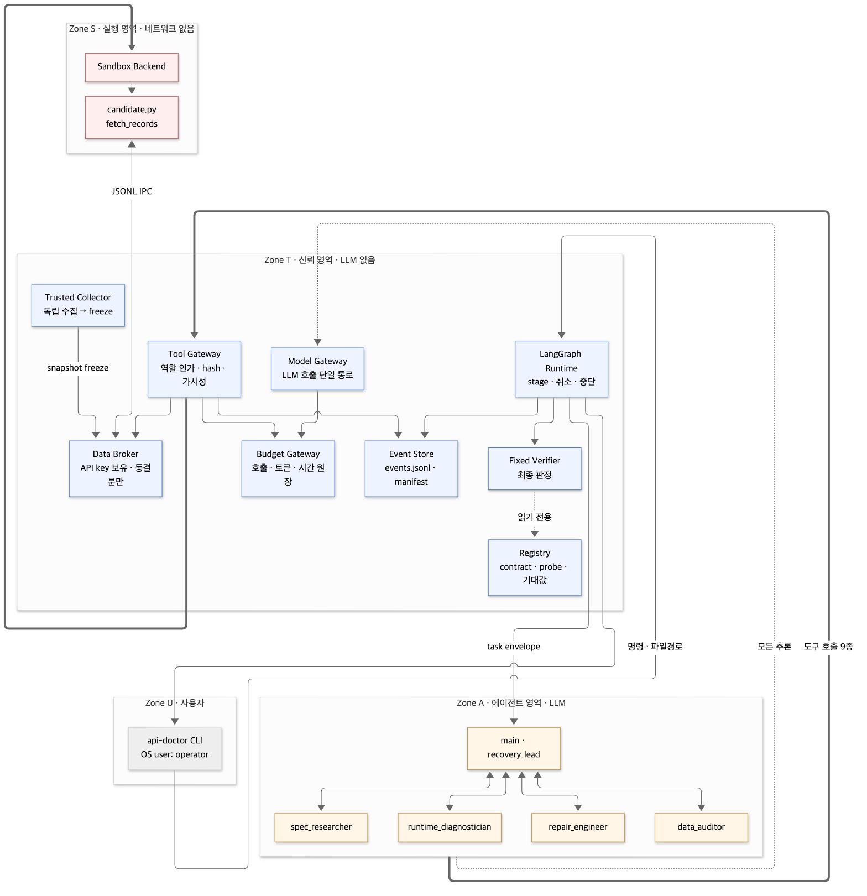
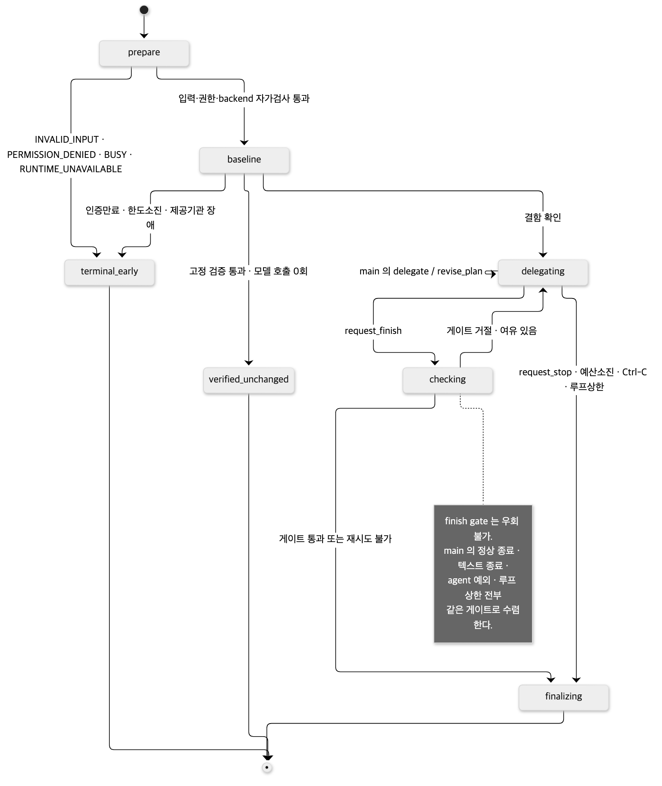
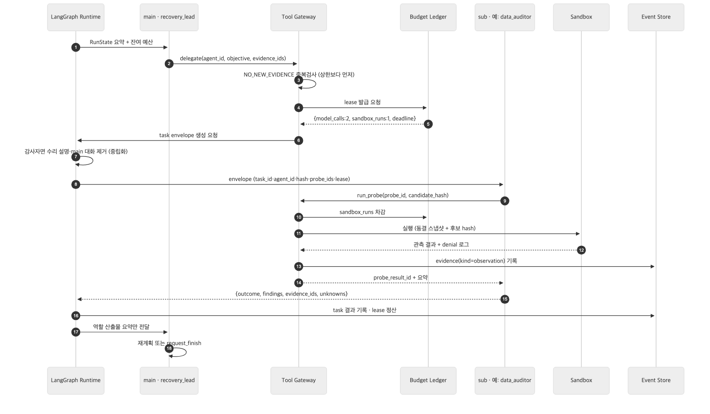
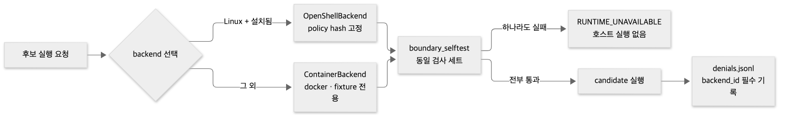
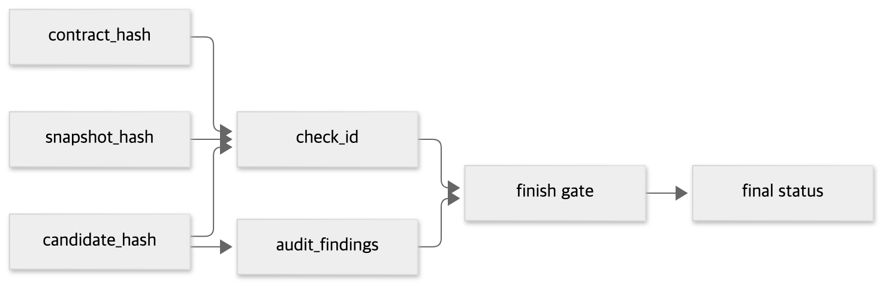
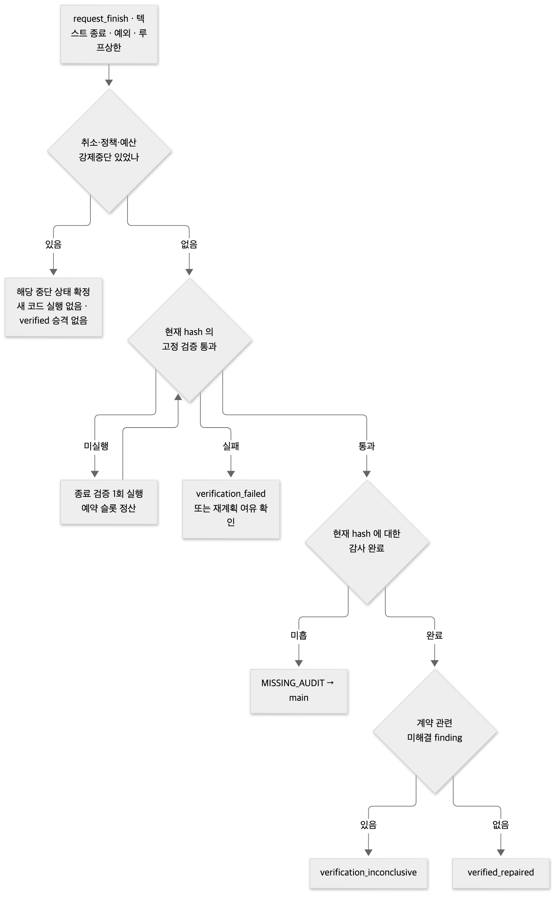

# API닥터 아키텍처 다이어그램

[ARCHITECTURE_api-doctor_v0.2.md](../ARCHITECTURE_api-doctor_v0.2.md) 본문의 그림을 이미지로 렌더한 것이다.
`.mmd` 가 원본이고 `.svg`(문서용) · `.png`(발표·Devpost용, 2x)는 생성물이다.

재생성:

```bash
cd docs/architecture
for f in *.mmd; do
  npx -p @mermaid-js/mermaid-cli mmdc -i "$f" -o "${f%.mmd}.svg" -b white
  npx -p @mermaid-js/mermaid-cli mmdc -i "$f" -o "${f%.mmd}.png" -b white -s 2
done
```

| # | 그림 | 무엇을 보여주나 |
|---|---|---|
| 01 | [신뢰 영역](01-trust-zones.png) | U / T / A / S 네 영역과 경계를 넘는 것들. **아키텍처의 기준 그림** |
| 02 | [상태기계](02-state-machine.png) | prepare → baseline → delegating → checking → finalizing 과 종료 상태 |
| 03 | [위임 시퀀스](03-delegation-sequence.png) | main 이 서브를 부를 때 lease·envelope·evidence 가 오가는 순서 |
| 04 | [샌드박스 backend 선택](04-sandbox-backend.png) | OpenShell 우선, 컨테이너 대안, 호스트 실행 없음 |
| 05 | [hash 체인](05-hash-chain.png) | 3-hash 조합이 STALE 판정을 자동으로 만드는 구조 |
| 06 | [종료 게이트](06-finish-gate.png) | 우회 불가 지점의 4단 분기 |

## 01 · 신뢰 영역



파란색이 LLM 없는 신뢰 영역, 주황색이 에이전트, 빨간색이 격리 실행 영역이다.
굵은 화살표는 강제 통과 지점이다 — 에이전트의 모든 도구 호출은 Tool Gateway 를,
후보 실행은 Sandbox 를 반드시 거친다.

## 02 · 상태기계



## 03 · 위임 시퀀스



## 04 · 샌드박스 backend 선택



## 05 · hash 체인



## 06 · 종료 게이트


